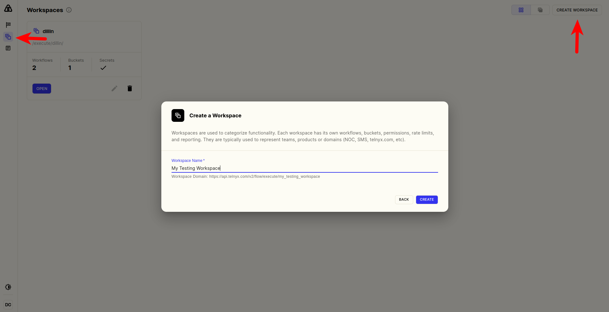
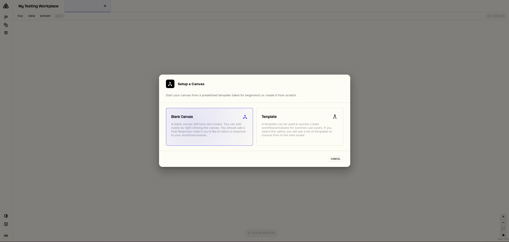
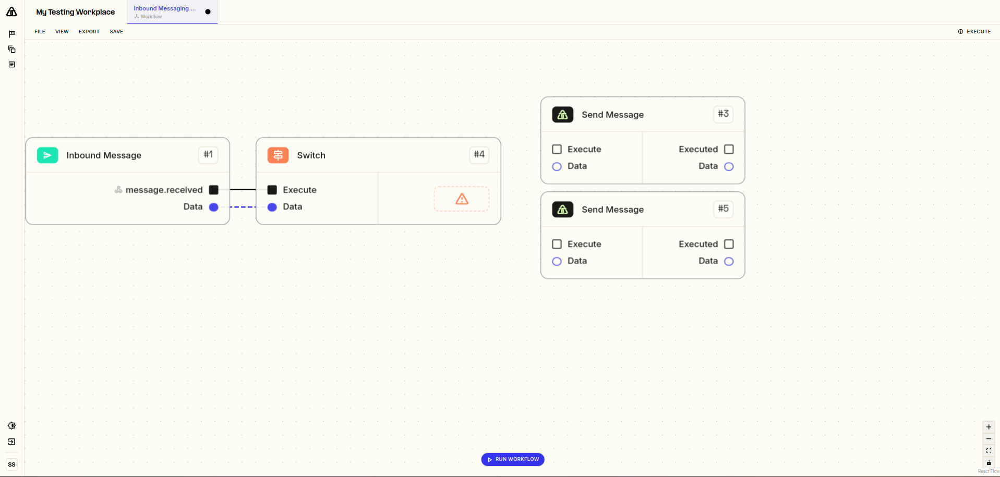
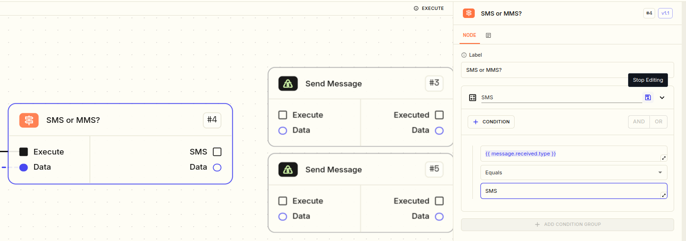
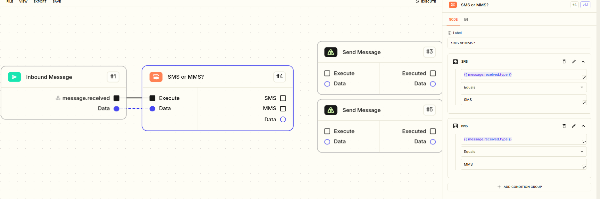
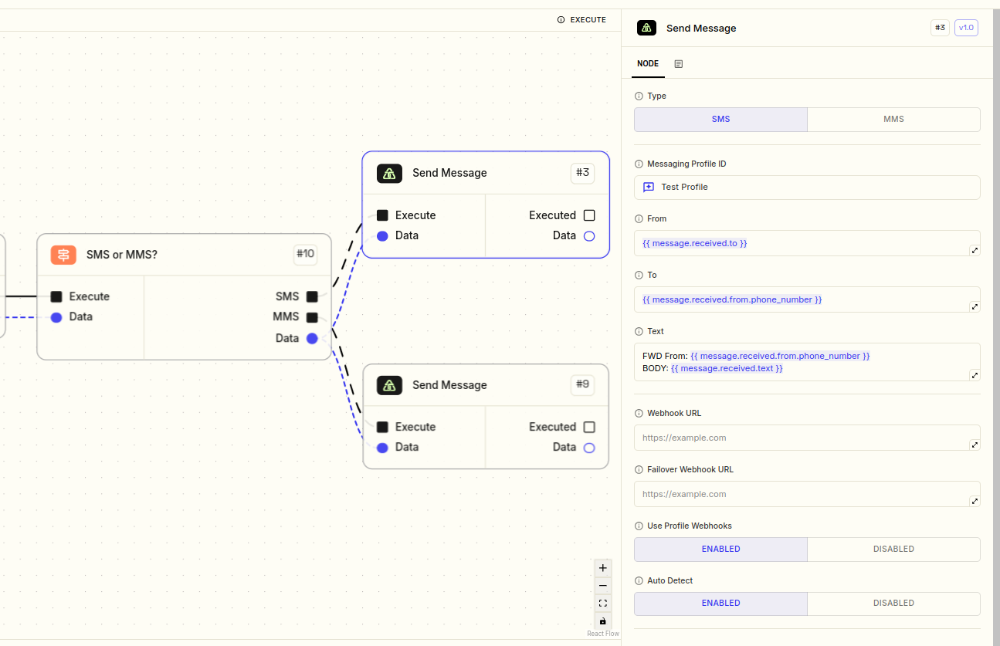
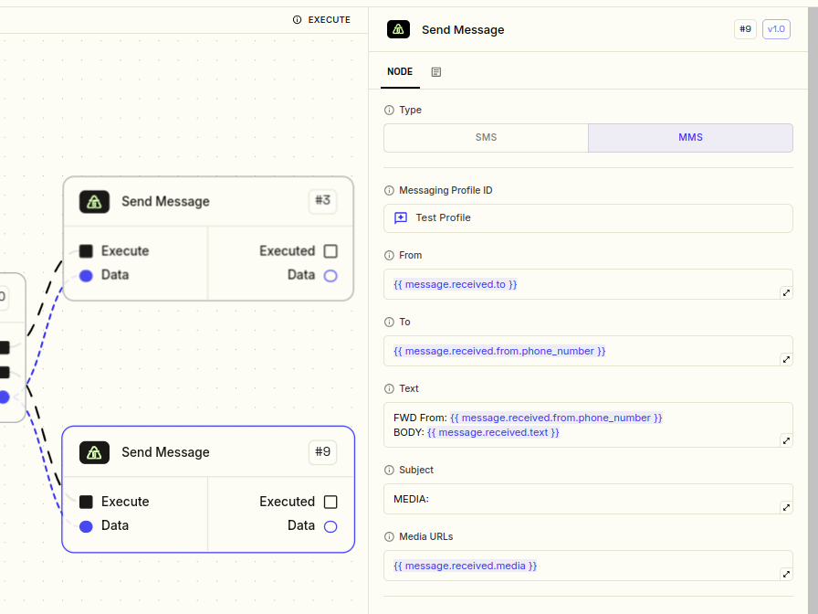
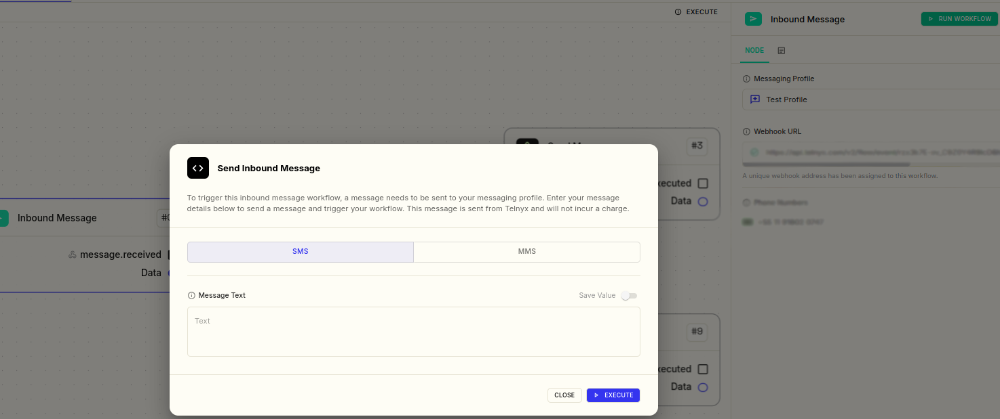

# Forwarding SMS/MMS Automation using Telnyx Flow

**Flow has been deprecated. This article is retained for reference and describes the deprecated Flow product.**

## Introduction

This guide will teach you how to quickly set up Telnyx Flow to automate forwarding actions to inbound messages.

We'll cover the following scenario of Telnyx Flow implementation:

- **Set up a Message Forwarding logic that redirects all the inbound messages destined to a Telnyx number and sends them to your mobile number.**

For this tutorial, you will need to have these settings and resources in your Telnyx Account:

- Telnyx Phone Number(s) must be enabled for messaging;
- The said Phone Number must be assigned to an approved 10DLC Campaign. (Article: [Register for 10DLC](https://intercom.help/telnyx/en/articles/6325731-register-for-10dlc-messaging))
- Create a dedicated Messaging Profile and assign the Telnyx numbers to the profile ( Article: [Messaging First Steps at Telnyx](https://intercom.help/telnyx/en/articles/3562059-setting-up-a-messaging-profile))

We also suggest you read the [Getting Started with Telnyx Flow](https://intercom.help/telnyx/en/articles/9413928-getting-started-with-telnyx-flow) article for a deeper understanding of how Telnyx Flow can improve your workflows, including powerful AI tools.

## **Creation and Set up of the Workflow**

**1. Log In**: Visit [flow.telnyx.com](https://flow.telnyx.com/), where you’ll be redirected to log into your Telnyx Mission Control account. If you don’t have an account, you can sign up [here](https://portal.telnyx.com/#/login/signup).

- *Note*: You may be logged out after a period of inactivity. Simply log back into Mission Control and refresh Telnyx Flow to continue.

2. Create a New Workspace:

Image 1 - Workspace

3. Create a new Workflow with a Blank Canvas

Image 2 - Blank Canvas

4. Right-click anywhere in the canvas to add the following nodes:

- "*Inbound Message*": the Trigger that upon receiving an inbound message will start the automation;
- "*Switch*": the logic node that will select if the inbound message is SMS or MMS;

  - Connect these 2 nodes as shown in **Image 3**.
- "*Send Message*": Node that will be responsible for the outbound action

  - Note: Add two "*Send Message*" nodes, one for SMS and one for MMS
- Click "*Save*" on the top left corner menu.

Image 3 - Nodes added to Canvas

5. Creating the Conditions on the Switch node:

- Add a descriptive Label: "*SMS or MMS?*"

- Add a condition group:

  - Name it "*SMS*"
  - On "*input*" type in the variable `{{message.received.type}}`
  - The comparison logic is "*Equals*"
  - On "*Value*" type in "*SMS* (without quotes)
- Click on the Blue Disk icon to save the Condition Group.

Image 4 - SMS Condition Group

- Add another condition group, repeating the same steps but now for the "*MMS*" condition:

Image 5 - All Condition Groups on Switch Node

- Connect each "*SMS*", "*MMS*" and "*Data*" Switch node output to a Send Message node:

Image 6 - Send Message Node Set-up

The settings for each Send Message node are similar:

- ***Type***: SMS or MMS selection (select according to the Switch output connected to the node)
- ***Messaging Profile ID***: You can choose from a drop-down menu. (Since we are originating the forwarded message from the recipient Telnyx number, the Messaging Profile ID will be the same as the Inbound Message node.)
- ***From*** and ***To***: the variables contained in the input Data that inverts the From and To of the inbound message. (The ***From*** field can also be a fixed originating number, depending on the user's choice)
- ***Text***: You can customize the message body that composes the forwarded message. In Image 6, there's an example of how to use the variables within the text field.

  - *For this Tutorial, the other sections of the Send Message Node will remain default; further details are covered in the dedicated article.*

The only distinction between the respective Send Message nodes for SMS and MMS is the dedicated field related to the MMS media: Subject and Media URLs, however with a similar logic for customization and variable usage as shown in Image 7:

Image 7 - MMS Send Message Set-up

And you're done!

Click the Save button to deploy your workflow settings.

## Testing your Workflow

To facilitate iterations, you can also test the workflow right from the Telnyx Flow:

- Go and click on the first nodeInbound Message and click on the "Run Workflow" green button at the top right corner, there you can type a test inbound message to execute your workflow:

Image 8 - Testing the Workflow inside Telnyx Flow

We hope this article is useful in your journey as a Telnyx Customer and if you have any questions or suggestions, feel free to contact us at [support@telnyx.com](mailto:support@telnyx.com).

Thank you for reading!

---

Related Articles

- [What is Telnyx?](https://support.telnyx.com/en/articles/1130637-what-is-telnyx)
- [Forwarding SMS to Your Mobile Number](https://support.telnyx.com/en/articles/3231942-forwarding-sms-to-your-mobile-number)
- [Automated Replies for Messages using Zapier](https://support.telnyx.com/en/articles/3232529-automated-replies-for-messages-using-zapier)
- [Receiving SMS on your Telnyx number](https://support.telnyx.com/en/articles/4348981-receiving-sms-on-your-telnyx-number)
- [FAQs about MMS at Telnyx](https://support.telnyx.com/en/articles/4450150-faqs-about-mms-at-telnyx)
