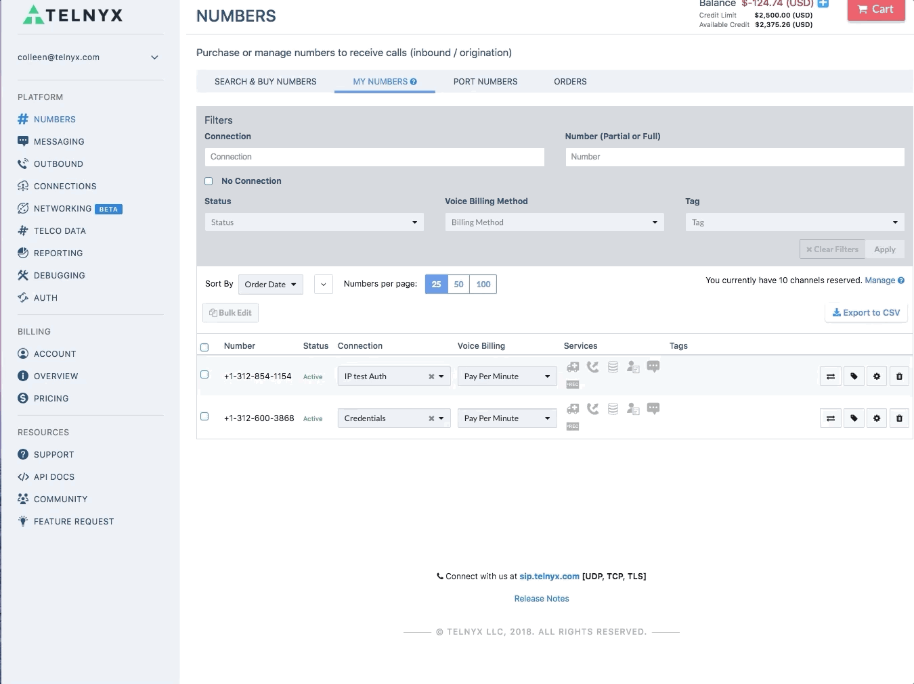

# What does the “Tech Prefix” option do?

## What does the “Tech Prefix” option do?

A tech prefix is a numeric string that is prepended to the front of a number.   
​  
In your mission control portal go to the "Connections" header. Click the settings wheel on the right hand side of the connection you want to have the tech prefix enabled on and choose "Basic Options". You will see a pop up with the option of "Expert IP Auth Settings". Here you can enable a Tech Prefix.  
​   
(Please see the example below)

Enabling a tech prefix is useful if you want to segment your traffic, allowing you to send your traffic to different trunks depending on the tech prefix.It is important to note, however, that you will also have to configure the tech prefix on your PBX system for this functionality to be realized.   
​  
The tech prefix box is where you will enter 4 digits of your choice e.g. 1234.  
​  
Press update once you have completed this and now your connection will segment traffic.

## Can't find what you're looking for? Click the chat bubble at your lower right hand corner and start a chat!

---

Related Articles

- [FreePBX Trunk Settings With Telnyx](https://support.telnyx.com/en/articles/1130620-freepbx-trunk-settings-with-telnyx)
- [Configuring an Elastix 4 PBX IP Trunk](https://support.telnyx.com/en/articles/1130622-configuring-an-elastix-4-pbx-ip-trunk)
- [How to configure a Thirdlane PBX](https://support.telnyx.com/en/articles/1130631-how-to-configure-a-thirdlane-pbx)
- [IP Authentication with Tech Prefix](https://support.telnyx.com/en/articles/2602782-ip-authentication-with-tech-prefix)
- [FreePBX V15: Credentials - PJSIP](https://support.telnyx.com/en/articles/5619597-freepbx-v15-credentials-pjsip)
