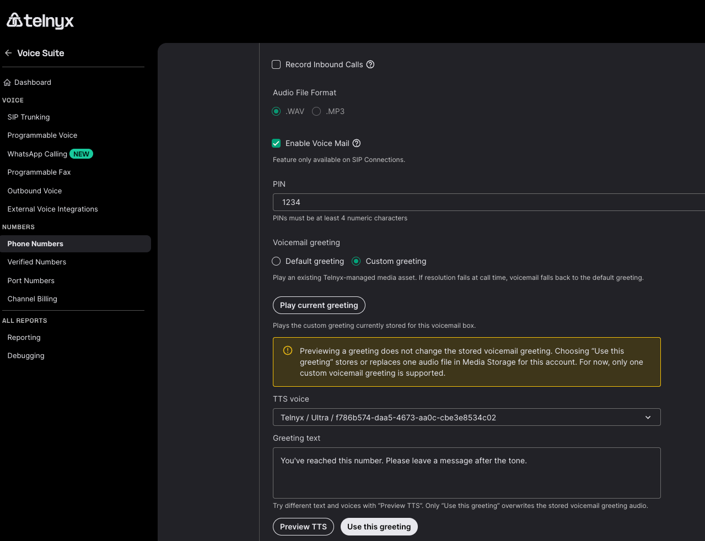

# Custom Voicemail Greetings

#

Custom voicemail greetings let you personalize what callers hear when they reach your voicemail on a Telnyx phone number. You can use the default text-to-speech greeting or create a custom TTS greeting with your own message.

## **How voicemail greetings work**

When someone calls your Telnyx number and the call goes to voicemail, the caller hears a greeting before being prompted to leave a message. Telnyx supports two greeting modes:

|  |  |
| --- | --- |
| Mode | What callers hear |
| **Default TTS** | A standard Telnyx greeting that includes the dialed number (e.g., "This is a voicemail service for [number]. Please leave your message after the tone."). |
| **Custom TTS** | A greeting message you write, rendered with text-to-speech and saved as an audio file. |

Custom TTS greetings are rendered and stored when you save them — they are not regenerated on every call. If a custom greeting is missing or cannot be played for any reason, the system automatically falls back to the default greeting.

Note: Custom voicemail greetings are configured per phone number. Each number can have one active greeting at a time.

# **Before you begin**

- **Voicemail must be enabled** on your Telnyx phone number. You can enable voicemail in the Mission Control Portal under your number's settings, or via the Telnyx API.
- **An active Telnyx phone number** that you own and manage on your account.
- **Portal access** with permissions to manage phone numbers and voicemail settings.
- **A SIP Connection** on the number — voicemail is available for SIP Connections.

# **Set up a custom voicemail greeting**

### **Option 1: Use the default greeting**

If you do not configure a custom greeting, Telnyx uses the default greeting automatically. The default greeting speaks the dialed number and prompts the caller to leave a message.

No configuration is needed; this is the default behavior when voicemail is enabled.

### **Option 2: Create a custom TTS greeting**

A custom TTS greeting lets you write your own message and have it rendered with text-to-speech.

## **Through the Mission Control Portal**

[](https://downloads.intercomcdn.com/i/o/ltcafuzd/2527236600/04764b0cb13e43e724fc937fc893/d8fb560b-3b7c-4038-aa04-3b34adee46ab?expires=1789491600&signature=77945733a3530a4b214c1dc36b0c09faf1f90f4a67e3953093e0acddc3ceb55b&req=diUlEct9m4dfWfMW1HO4zXCpY7%2B4ZqvmkkgPj%2FbyB%2FqcmiaFJA%2Frwjq%2BlB74%0A2XoNPTxomtAT4%2FTLHqY%3D%0A)

1. Sign in to the [Mission Control Portal](https://portal.telnyx.com/).
2. Navigate to **Phone Numbers** and select the number you want to configure.
3. Open the **Voice** tab and go to **Voicemail** settings for that number.
4. In the **Greeting** section, select **Custom greeting**.
5. Select **Play Current Greeting t**o reproduce your current greeting
6. Choose a TTS voice from the voice selector dropdown.
7. Enter your custom greeting text in the greeting text field.
8. Click **Preview TTS** to hear how your greeting will sound. Previewing does not change your stored greeting.
9. Click **Use this greeting** to render and activate the greeting.

When you save, Telnyx renders your greeting text into audio and stores it. The next time a caller reaches voicemail on that number, they will hear your custom greeting.

Note: Only one custom voicemail greeting is supported per number. Saving a new greeting replaces the previous one.

## **Through the Telnyx API**

Before setting a custom greeting via the API, upload your greeting audio to Telnyx using POST /v2/media. Then reference the returned media\_name in the voicemail configuration:

```
curl -X POST "https://api.telnyx.com/v2/phone_numbers/{number_id}/voicemail" \
  -H "Authorization: Bearer YOUR_API_KEY" \
  -H "Content-Type: application/json" \
  -d '{
    "enabled": true,
    "pin": "1234",
    "greeting": {
      "mode": "custom_greeting",
      "media_name": "custom_greeting_acme"
    }
  }'
```

**Note**: The media\_name field references an audio file uploaded via POST /v2/media. When using the Mission Control Portal, the greeting text editor handles TTS rendering and media upload automatically.

# **Manage your greeting**

## **Check which greeting is active**

You can view the active greeting mode in the Mission Control Portal under the number's voicemail settings, or via the API:

```
curl "https://api.telnyx.com/v2/phone_numbers/{number_id}/voicemail" \
  -H "Authorization: Bearer YOUR_API_KEY"
```

The response includes the current greeting mode and media information.

## **Revert to the default greeting**

To switch back to the default Telnyx greeting:

## **Through the Mission Control Portal**

1. Go to the number's **Voicemail** settings.
2. In the **Greeting** section, select **Default greeting**.
3. Click **Save**.

## **Through the API**

```
curl -X POST "https://api.telnyx.com/v2/phone_numbers/{number_id}/voicemail" \
  -H "Authorization: Bearer YOUR_API_KEY" \
  -H "Content-Type: application/json" \
  -d '{
    "enabled": true,
    "pin": "1234",
    "greeting": {
      "mode": "default"
    }
  }'
```

## **Replace a custom greeting**

To replace an existing custom greeting, simply save a new one. Setting a new greeting automatically replaces the previous one. There is no retention of replaced or deleted greeting audio — it is removed from storage.

## **Limits and guidelines**

- **One active greeting per number:** Each phone number can have only one active greeting at a time.
- **Fallback to default:** If a custom greeting cannot be played (for example, due to a temporary storage issue), the system automatically plays the default greeting.
- **Replaced greetings are deleted:** There is no retention period or recovery option for replaced greeting audio.

## **FAQ**

## **What happens if I do not set a custom greeting?**

Telnyx uses the default TTS greeting, which speaks the dialed number and prompts the caller to leave a message.

## **Can I use different greetings for different numbers?**

Yes. Greetings are configured per phone number. Each number can have its own custom greeting or use the default.

## **What TTS does Telnyx use for voicemail greetings?**

Telnyx generates voicemail greetings using its built-in TTS technology. Customers can choose from the available TTS engines to select the voice and quality that best suit their preferences.

## **Can I have multiple greetings and switch between them?**

No. Each number can have one active greeting at a time. To switch greetings, save a new one (Use this greeting), it replaces the previous greeting.

## **What happens to my old greeting when I replace it?**

The previous greeting audio is deleted from storage. There is no retention period or recovery option for replaced greetings.

## **Does the greeting play for both voicemail deposit and retrieval?**

The greeting plays when a caller is connected to voicemail to leave a message. Voicemail retrieval (checking your messages) has its own prompts.

---

Related Articles

- [Setting Up Telnyx Voicemail](https://support.telnyx.com/en/articles/5989560-setting-up-telnyx-voicemail)
- [Grandstream GXV3370](https://support.telnyx.com/en/articles/6187576-grandstream-gxv3370)
- [Verified Numbers](https://support.telnyx.com/en/articles/6988813-verified-numbers)
- [Bot-to-Bot Support API: Ask Telnyx Knowledge Agent](https://support.telnyx.com/en/articles/15455646-bot-to-bot-support-api-ask-telnyx-knowledge-agent)
- [Creating and sending email templates](https://support.telnyx.com/en/articles/16099893-creating-and-sending-email-templates)
