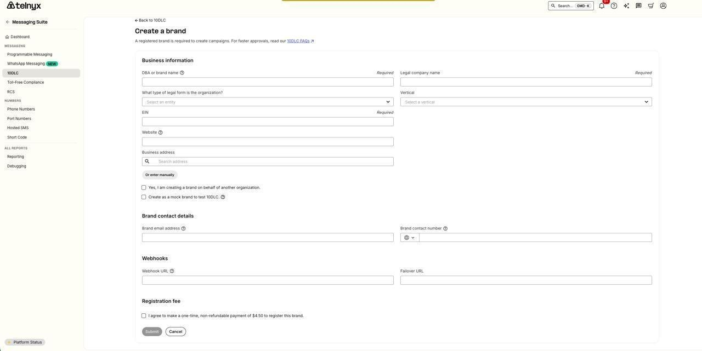
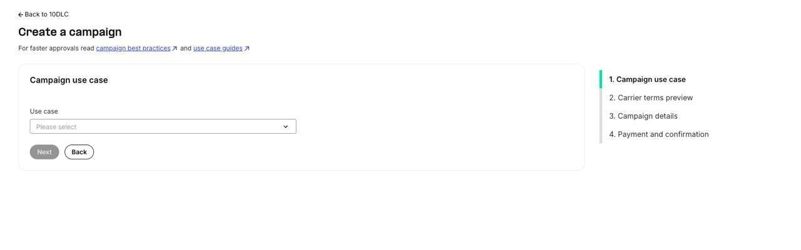
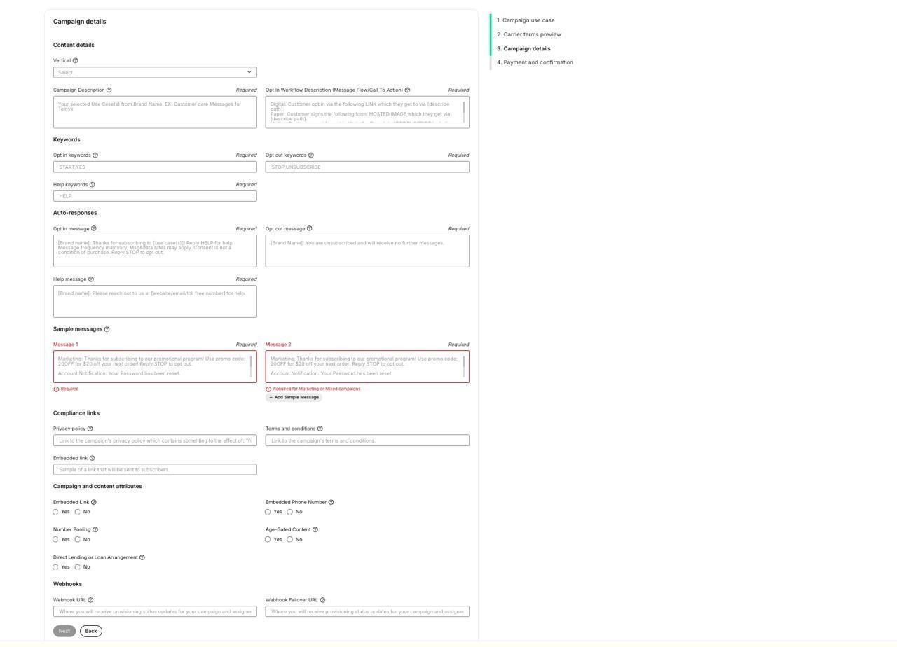

# 10DLC Campaign Compliance Guide

# 10DLC Campaign Compliance Guide

This guide walks you through the entire 10DLC campaign process — from brand registration to sending your first message. Each section links to detailed articles for deeper dives. If you're new to 10DLC, start at Step 1. If you already have a brand and need help with campaign compliance requirements, jump to Step 2.

# **What is 10DLC?**

10DLC (10-Digit Long Code) is the approved application-to-person (A2P) messaging solution for US local phone numbers. All businesses sending SMS via US local numbers must register their brand and campaigns through The Campaign Registry (TCR) to remain compliant with carrier requirements.

The process has three main steps:

1. Register your Brand
2. Create and register your Campaign (with compliant opt-in mechanism)
3. Assign phone numbers to your campaign

There is a one-time $4 brand registration fee and a $15 campaign verification fee. *Note: The $15 campaign verification fee is only charged when the campaign is sent downstream to the aggregator for carrier review. Reviews performed at the Telnyx level are not charged.*

See [10DLC Fees and Charges](https://support.telnyx.com/en/articles/5634625-10dlc-fees-and-charges) for full pricing details.

# **Step 1: Register Your Brand**

Before creating a campaign, you must register your brand through the Telnyx Mission Control Portal. The brand registration validates your business identity with TCR and mobile network operators.

You'll need the following information ready:

- Legal company name (must match EIN)
- DBA or brand name
- Business entity type (Private, Public, Non-Profit, Government)
- Industry vertical
- EIN (Employer Identification Number)
- Business website URL
- Business address
- Brand email address and contact number
- Stock symbol and exchange (publicly traded companies only)

## **How to Register**

1. Log in to the Telnyx Mission Control Portal and navigate to Messaging → 10DLC.
2. Click "Create a brand" to open the brand registration form.

*The brand registration form in the Telnyx Mission Control Portal.*

1. Fill in the Business Information section:

- DBA or brand name — the name customers know you by
- Legal company name — must match your EIN exactly
- Legal form type — select your entity type (Private, Public, Non-Profit, or Government)
- Vertical — select your industry
- EIN — your Employer Identification Number
- Website — your business website URL
- Business address — enter your business address (or search and autofill)

1. Fill in the Brand Contact Details section with your brand email address and contact phone number.
2. If you want to receive webhooks for brand status updates, fill in the Webhook URL and Failover URL fields (optional).
3. Check the registration fee checkbox to agree to the one-time $4.50 brand registration fee.
4. Click Submit. Your brand will be submitted to TCR for verification.

**Key points:**

- Your brand's Trust Score (assigned during registration) determines your message throughput. This score does not change over time, so accurate registration is critical.
- Publicly traded companies (Public\_Profit) must complete an Auth+ 2FA verification process before campaigns can be created.
- If your brand is not verified, check for errors in your registration info — most commonly an EIN mismatch.
- Third-party vetting is available to potentially improve your Trust Score.
- If you're a sole proprietor, there's a simplified registration process available.

*Full guide: [How to Create a 10DLC Brand](https://support.telnyx.com/en/articles/5896911-how-to-create-a-10dlc-brand)*

*[10DLC Trust Scores & Use Cases](https://support.telnyx.com/en/articles/6325747-10dlc-trust-scores-use-cases)*

*[Guide to Sole Proprietor 10DLC Registration](https://support.telnyx.com/en/articles/13545282-guide-to-sole-proprietor-10dlc-brand-and-campaign-registration)*

# **Step 2: [Campaign Compliance Requirements](https://support.telnyx.com/en/articles/9940291-10dlc-campaign-compliance-requirements)**

This is the most critical step. Your campaign must meet all compliance requirements at the time of submission — mechanisms should be in place before registering, not added after. Campaigns are reviewed by Telnyx and then by mobile network operators. Non-compliant campaigns will be rejected or suspended.

*For a quick pre-submission checklist, see: [Messaging - 10DLC Campaign Checklist](https://support.telnyx.com/en/articles/9038141-messaging-10dlc-campaign-checklist)*

## **Call-to-Action (CTA) Requirements**

The Call-to-Action (CTA) is the language and mechanism that invites a consumer to opt into your messaging program. It must be clearly and unambiguously displayed and include all of the following disclosures:

- Program (Brand) Name — the subscriber must know who is texting them
- Product Description — what type of messages they will receive
- Message Frequency Disclosure — e.g., "Message frequency may vary"
- Cost Disclosure — "Standard Message and Data Rates may apply"
- Opt-out — "Reply STOP to opt out"
- Help — "Reply HELP for help"
- Terms and Conditions — accessible via a link in proximity to the CTA. Pop-ups are not an acceptable method for displaying Terms and Conditions.
- Privacy Policy — displayed on the form or accessible via a link from the CTA
- SMS-only consent — opt-in language must be specific to text messages. It cannot be combined with email or phone call consent; those must be handled separately.

## **TCR Link Requirements**

All campaigns must include the URL for the Terms and Conditions and Privacy Policy within TCR. These can be entered in the designated TCR fields or within the CTA section. Even if these policies are available on your website, they must also be displayed within TCR.

## **Consent Types**

There are three types of consent recognized under 10DLC. Your campaign's message flow must document which type applies.

## **1. Implied Consent**

If the consumer initiates the text message exchange and the business only responds with relevant information, no verbal or written permission is needed — the consumer's initiation of contact serves as consent.

**Requirements:**

- The first message must always be sent by the consumer
- The message flow must clearly and unmistakably explain how the customer contacts the business
- The business may only respond with relevant information to each consumer message

Example: A customer texts to your number asking about their upcoming appointment. You respond with appointment details.

**Confirmation script:** "When the user texts the number, the system responds with: Thank you for your message to [Brand Name]! You are now subscribed to [use case] messages. Msg freq may vary. Std msg & data rates apply. Reply STOP to opt out, HELP for help. We will not share or sell your mobile information for marketing/promotional purposes."

## **2. Express Consent**

The consumer gives express permission before a business sends them a text message. This can happen via text, web form, or verbal consent.

## ***2.1 Opt-in by Text (Keyword)***

The customer opts in by texting a specific keyword to a designated phone number. The workflow must include the exact keyword and the designated phone number.

Example: "Customer opts in by sending 'WELCOME' to phone number +1 234-567-8901"

**Confirmation script:** "When the user texts [Keyword], the system responds with: Thank you for opting in to [Brand Name] SMS [update type]! Msg freq may vary. Std msg & data rates apply. Reply STOP to opt out, HELP for help. Your mobile information will not be sold or shared with third parties for promotional or marketing purposes."

## ***2.2 Opt-in by Web Form***

The customer provides consent through a web form. See our [10DLC Opt-In Form](https://support.telnyx.com/en/articles/10684260-10dlc-opt-in-form) article for detailed form requirements and an example.

**Key requirements:**

- The SMS consent checkbox must be optional — the subscriber must be able to submit the form without being forced into SMS opt-in
- Opt-in language must appear at the bottom of the form, clearly stating frequency, msg & data rates, and that text messages will be sent
- The opt-in must be exclusively for text messages — email and call consent must be handled separately
- The form must be fully functional and record consent upon submission

**Marketing Use Case Example:** "By submitting this form and signing up for texts, you consent to receive marketing text messages (e.g. promos, cart reminders) from [Brand Name] at the number provided, including messages sent by autodialer. Consent is not a condition of purchase. Msg & data rates may apply. Msg frequency varies. Carriers are not liable for delayed or undelivered messages. Unsubscribe at any time by replying STOP or clicking the unsubscribe link (where available). Text HELP for support. Privacy Policy [link] & Terms [link]."

**Best practices:**

- If the opt-in is not on the website's main page, provide the specific URL where the opt-in occurs
- Clearly specify the location on the page (e.g., "Customers opt in through the contact form at the bottom of the page")
- If using a pop-up form, note in the message flow that a pop-up form will appear
- If the form is a pop-up or behind a login, include a screenshot in the message flow submission (uploaded to a public image host such as Imgur or Google Drive with a shareable link)

## ***2.3 Opt-in by Verbal Consent***

The customer provides consent verbally, either during a phone call or in person. The process must clearly outline the scenario in which consent is given.

Example: "The customer will verbally opt in during a phone conversation with one of our customer service representatives, who will ask if they would like to receive text messages from our company."

**Note:** Verbal opt-ins for marketing and political/charity use cases now require a double opt-in (the consumer must also confirm via a follow-up text). For the latest templates and requirements, see: *[Guide to 10DLC Message Flow Field](https://support.telnyx.com/en/articles/10562019-guide-to-10dlc-message-flow-field)*

## **3. Express Written Consent**

The consumer gives express written permission before a business sends them a text message. This typically involves signing a physical or digital form.

For paper forms, the form must be attached to TCR for verification purposes.

Example: "The customer completes a form at the doctor's office that includes opt-in language agreeing to receive text message communications."

*For templates for each consent type, see: [Guide to 10DLC Message Flow Field](https://support.telnyx.com/en/articles/10562019-guide-to-10dlc-message-flow-field)*

## **Subscriber Opt-in, Opt-out, and Help Messages**

Each campaign must include keywords and sample messages for opt-in confirmation, opt-out, and help. These must follow the required templates:

- **Opt-in confirmation message must include:** [Brand Name], instructions on how to request help, message frequency disclosure, "message and data rates may apply", and opt-out instructions (Reply STOP to opt out)
- **Help message must include:** [Brand Name] and customer care contact information (e.g., "Please reach out to us at [email or phone number] for help")
- **Opt-out message must include:** [Brand Name], confirmation of opt-out, and statement that no further messages will be sent

*For templates and formatting, see: [10DLC Keywords and Confirmation Messages](https://support.telnyx.com/en/articles/10645338-10dlc-keywords-and-confirmation-messages)*

## **Sample Messages**

Sample messages must correspond to the registered use case. If a campaign is registered under multiple use cases (mixed), a sample message for each use case must be provided. Marketing use cases require a minimum of 2 sample messages.

**Best practices for samples:**

- Keep samples under 160 characters (industry best practice)
- Include opt-out language in at least one sample (e.g., "Reply STOP to opt out")
- If Embedded Link or Embedded Phone Number attributes are checked, samples must contain a link/phone number
- Samples must be consistent with brand, campaign description, and website

## **[Terms and Conditions](https://support.telnyx.com/en/articles/9940291-10dlc-campaign-compliance-requirements)**

Terms and Conditions may be accessible via a link in proximity to the CTA. Pop-ups are not acceptable.

**Required SMS program disclosures within Terms and Conditions:**

- Program (brand) name
- Product description
- Message frequency disclosure (not required for single-message programs)
- Customer care contact information
- Opt-out information (not required for single-message programs)
- "Message and data rates may apply"

## **Privacy Policy**

A privacy policy must be maintained for all programs and made accessible from the initial CTA. The privacy policy must be for the brand being registered — not a reseller's policy, and not a generic Google privacy policy.

**Requirements:**

- Privacy policy link must be labeled clearly
- Must provide up-to-date, accurate information about program details

## **Third-Party Data Sharing**

Any mention of third-party data sharing, renting, or selling is disallowed unless the following disclosure is included:

*"All the above categories exclude text messaging originator opt-in data and consent; this information will not be shared with any third parties."*

If your privacy policy already provides for data sharing or selling to nonaffiliated third parties, it must clarify that such sharing will not include SMS opt-in data or consent status. The privacy policy should also include:

*"Information will not be sold or shared with third parties for promotional or marketing purposes."*

***Example:*** "We will not share your opt-in to an SMS campaign with any third party for purposes unrelated to providing you with the services of that campaign. We may share your Personal Data, including your SMS opt-in or consent status, with third parties that help us provide our messaging services, including but not limited to platform providers, phone companies, and any other vendors who assist us in the delivery of text messages."

Note: The verbiage must cover any method of transfer — if it only says data won't be "sold," that is insufficient. It must also cover "sharing" (e.g., transfers between affiliates).

*Full guide: [10DLC Privacy Policy](https://support.telnyx.com/en/articles/10645583-10dlc-privacy-policy)*

## **Age Verification (if applicable)**

Messaging content for controlled substances or adult content may be subject to additional carrier review. This type of messaging must include robust age verification.

**Current acceptable age verification methods:**

- Website age gates (user must enter or confirm date of birth on a website before proceeding)
- Verbal age confirmation: "A customer may call or be present in the store. Before continuing, age is confirmed of 21 years or older. An employee will then present the consent process verbally."
- Document upload (government ID)
- Third-party identity verification services
- Credit card verification

Not acceptable: Asking a user to "reply YES" or "reply AGREE" to confirm they are over a certain age is not robust age verification.

## **Political Campaigns**

Special requirements for political campaigns:

- Political/organization name must be clearly identified
- Politician/organization website must be provided
- If donations are part of the program:
- The CTA and campaign description must clearly disclose whether donations will or will not be solicited
- Political campaigns must also be verified at campaignverify.com, which provides a token required for registration.

# **Step 3: Create Your Campaign**

Once your brand is registered and your compliance mechanisms (opt-in form, privacy policy, keywords, sample messages) are in place, you're ready to create your campaign in the Mission Control Portal or via the Telnyx API.

## **How to Create**

1. In the Telnyx Mission Control Portal, navigate to Messaging → 10DLC and click "Create a campaign".
2. Select your campaign use case from the dropdown. This determines the category of messaging you'll be sending (e.g., Marketing, 2FA, Customer Care, Alerts, etc.). Click Next.

*Step 1: Select your campaign use case. The 4-step progress tracker is shown on the right.*

1. Review the carrier terms and conditions, then click Next to proceed to the Campaign Details form.
2. Fill in the Campaign Details form. This is the most important step — all compliance fields are here:

*Step 3: The Campaign Details form with all compliance fields.*

- Vertical — select your industry vertical
- Campaign Description — describe what your campaign does (40–4096 characters). Must be consistent with your brand and website.
- Message Flow / Call To Action — document exactly how users opt in to your messaging program (40–2048 characters). This is critical for compliance review. See [Guide to 10DLC Message Flow Field](https://support.telnyx.com/en/articles/10562019-guide-to-10dlc-message-flow-field) for templates.
- Keywords — enter your opt-in keywords (e.g., START, YES), opt-out keywords (e.g., STOP, UNSUBSCRIBE), and help keywords (e.g., HELP). See [10DLC Keywords and Confirmation Messages](https://support.telnyx.com/en/articles/10645338-10dlc-keywords-and-confirmation-messages) for templates.
- Auto Responses — write your opt-in confirmation message, opt-out message, and help message. Each must follow required templates (see above).
- Sample Messages — provide at least 1 sample per use case (2 minimum for marketing). Samples must match your registered use case and include opt-out language.
- Privacy Policy URL — link to your brand's privacy policy (must include third-party sharing disclosure if applicable). See [10DLC Privacy Policy](https://support.telnyx.com/en/articles/10645583-10dlc-privacy-policy) for requirements.
- Terms and Conditions URL — link to your campaign's terms and conditions.

1. Click Next to review your campaign details, then click Submit to send your campaign for review.

**Important:**

- Campaigns are reviewed by Telnyx first (internal compliance review), then sent to the downstream aggregator for carrier (MNO) review.
- Carrier review typically takes 72 business hours after Telnyx approves and sends the campaign downstream.
- You will not be charged the $15 campaign verification fee until the campaign is sent downstream for carrier review.

*Full guide: [How to Create a 10DLC Campaign](https://support.telnyx.com/en/articles/6339152-how-to-create-a-10dlc-campaign)*

*[10DLC Campaign Approval Best Practices](https://support.telnyx.com/en/articles/7127078-10dlc-campaign-approval-best-practices)*

# **Step 4: Assign Phone Numbers to Your Campaign**

After your campaign is approved by the carrier, assign phone numbers to start sending messages.

1. In the Telnyx Mission Control Portal, navigate to Messaging → 10DLC → your campaign.
2. Click "Assign numbers" and select the phone number(s) you want to assign.
3. Click Assign. Numbers are typically active within a few minutes.

**Important notes:**

- A number can only be associated with one campaign, but a campaign can have up to 49 numbers
- The 49-number limit is a T-Mobile restriction; exceeding it requires a T-Mobile Number Pool Request form (additional charges apply)
- You must have an SMS-capable Telnyx phone number (purchase or port one first)
- If your campaign shows "Suspended" status, it may be dormant from inactivity — reassign numbers twice to reactivate

*Full guide: [How to Assign a Number to a Campaign](https://support.telnyx.com/en/articles/6325734-how-to-assign-a-number-to-a-campaign)*

*[10DLC Campaign Suspended](https://support.telnyx.com/en/articles/10723378-10dlc-campaign-suspended)*

*[10DLC Number Assignment Status](https://support.telnyx.com/en/articles/11072276-10dlc-number-assignment-status)*

# **Step 5: Start Sending & Best Practices**

Once your numbers are assigned, you can begin sending messages. Follow these best practices to maintain compliance:

- User Consent: Provide full transparency so consumers only receive messages from programs they opted into.
- Opt-in: Consumers must opt in to a specific program. Enrolling a consumer in multiple programs from a single opt-in is prohibited.
- Opt-out: Acknowledge and act on all opt-out requests immediately. Monitor to confirm successful opt-out.
- Opt-in Confirmation: Send a single confirmation message verifying enrollment, identifying the program, and describing how to opt out.
- Message Content: Send messages consistent with your registered use case and sample messages. Inconsistent content may be flagged for review.
- Keep campaigns active: Campaigns with no activity for 15+ days and no assigned numbers may be suspended to avoid T-Mobile inactivity fines.

# **Troubleshooting**

## **Campaign Rejected**

If your campaign is rejected, Telnyx will reach out to help fix and resubmit. Common rejection reasons include: inconsistent brand/website/samples, non-compliant opt-in form, missing CTA disclosures, non-compliant privacy policy, or prohibited use cases.

*See: [10DLC Carrier Error Codes Explanations](https://support.telnyx.com/en/articles/10547022-10dlc-carrier-error-codes-explanations)*

*[10DLC Error (806)](https://support.telnyx.com/en/articles/10744086-10dlc-error-806)*

*[10DLC Campaign Approval Best Practices](https://support.telnyx.com/en/articles/7127078-10dlc-campaign-approval-best-practices)*

## **Campaign Suspended**

Campaigns may be suspended for inactivity (no messages for 15+ days with no assigned numbers). To reactivate: assign phone numbers twice — the first assignment reactivates the campaign (and fails), the second succeeds.

*See: [10DLC Campaign Suspended](https://support.telnyx.com/en/articles/10723378-10dlc-campaign-suspended)*

## **TCR Creation Failed / Invalid Date**

This indicates TCR rejected the campaign due to a technical issue (character requirement missed, wrong number of samples, etc.). This is different from a carrier rejection. Contact [10dlcquestions@telnyx.com](mailto:10dlcquestions@telnyx.com) for help identifying the failure reason.

## **Brand Not Verified**

Most likely cause is an error in brand registration info — review all fields, especially EIN. For EIN errors, contact [10dlcquestions@telnyx.com](mailto:10dlcquestions@telnyx.com) for assistance.

# **All 10DLC Articles**

- [How to Create a 10DLC Brand](https://support.telnyx.com/en/articles/5896911-how-to-create-a-10dlc-brand)
- [How to Create a 10DLC Campaign](https://support.telnyx.com/en/articles/6339152-how-to-create-a-10dlc-campaign)
- [How to Assign a Number to a Campaign](https://support.telnyx.com/en/articles/6325734-how-to-assign-a-number-to-a-campaign)
- [10DLC Opt-In Form](https://support.telnyx.com/en/articles/10684260-10dlc-opt-in-form)
- [Guide to 10DLC Message Flow Field](https://support.telnyx.com/en/articles/10562019-guide-to-10dlc-message-flow-field)
- [10DLC Keywords and Confirmation Messages](https://support.telnyx.com/en/articles/10645338-10dlc-keywords-and-confirmation-messages)
- [10DLC Privacy Policy](https://support.telnyx.com/en/articles/10645583-10dlc-privacy-policy)
- [10DLC Carrier Error Codes Explanations](https://support.telnyx.com/en/articles/10547022-10dlc-carrier-error-codes-explanations)
- [10DLC Error (806)](https://support.telnyx.com/en/articles/10744086-10dlc-error-806)
- [10DLC Campaign Approval Best Practices](https://support.telnyx.com/en/articles/7127078-10dlc-campaign-approval-best-practices)
- [Messaging - 10DLC Campaign Checklist](https://support.telnyx.com/en/articles/9038141-messaging-10dlc-campaign-checklist)
- [10DLC Campaign Suspended](https://support.telnyx.com/en/articles/10723378-10dlc-campaign-suspended)
- [10DLC Trust Scores & Use Cases](https://support.telnyx.com/en/articles/6325747-10dlc-trust-scores-use-cases)
- [10DLC Fees and Charges](https://support.telnyx.com/en/articles/5634625-10dlc-fees-and-charges)
- [10DLC Number Assignment Status](https://support.telnyx.com/en/articles/11072276-10dlc-number-assignment-status)
- [Guide to Sole Proprietor 10DLC Registration](https://support.telnyx.com/en/articles/13545282-guide-to-sole-proprietor-10dlc-brand-and-campaign-registration)
- [10DLC Shared Campaigns](https://support.telnyx.com/en/articles/5617538-10dlc-shared-campaigns)
- [Register for 10DLC Messaging](https://support.telnyx.com/en/articles/6325731-register-for-10dlc-messaging)

#

---

Related Articles

- [How to create a 10DLC campaign](https://support.telnyx.com/en/articles/6339152-how-to-create-a-10dlc-campaign)
- [10DLC Campaign Approval Best Practices](https://support.telnyx.com/en/articles/7127078-10dlc-campaign-approval-best-practices)
- [Messaging - 10DLC Campaign Checklist](https://support.telnyx.com/en/articles/9038141-messaging-10dlc-campaign-checklist)
- [10DLC Campaign Compliance Requirements](https://support.telnyx.com/en/articles/9940291-10dlc-campaign-compliance-requirements)
- [Guide to Sole Proprietor 10DLC Brand and Campaign Registration](https://support.telnyx.com/en/articles/13545282-guide-to-sole-proprietor-10dlc-brand-and-campaign-registration)
