# Toll-Free Submission Guide

Before starting this process, first check and make sure the Toll-Free number you want to verifiy for SMS is assigned to a messaging profile. This is the most common mistake prior to submitting and you will have to start the submission process over if the number is not assigned.

(Note: If you are unable to assign the Toll-Free number to a messaging profile, the number will need to be provisioned. Please contact [support@telnyx.com](mailto:support@telnyx.com) if this is the case.)

**Step 1. The Business Details page.**

[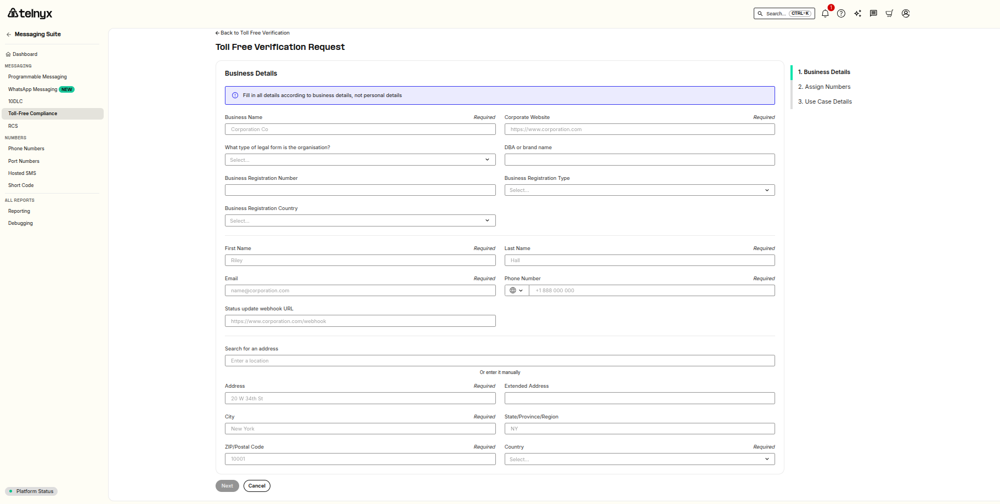](https://downloads.intercomcdn.com/i/o/ltcafuzd/2611860929/82e1b97323e4bbe34e0226b4a021/b874a892-8137-4aca-a941-ae38617bf160?expires=1789491600&signature=8deef1b613ed0821caba34adff5655a188a7a5ac8a82a7050ef49839c398fd1b&req=diYmF8F4nYhdUPMW1HO4zf13cSh8VQgAtXD14MqTZO0lbpdKFHiyzeDk0T%2BP%0Ac%2BsMzZWTWWJ2gx4cEBE%3D%0A)

**Step 1.1 Business Name**

In the Business Name field enter the legal Business Name of the company. This will be the registered business name on the business registration documentation from the country the business was registered in.

[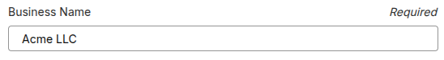](https://downloads.intercomcdn.com/i/o/ltcafuzd/2611860928/a415e28ad39f88baa6a42f2dfbaf/38fef54b-0cd5-4826-83d4-79a4a788222a?expires=1789491600&signature=ad85134821f271d488a4d67049f00e6db1e98c5bd670cefe5c937657a5161db2&req=diYmF8F4nYhdUfMW1HO4zd5eD1sNFYG6INo1mZBX6LIZ6RgBeNXKpxToPaxK%0AONMaxVevqdWFKFz07jw%3D%0A)

(Note: If you are a Sole Proprietor, you will place your literal name in this field, example: Clark Kent. Then the business name will be listed in the DBA field. )

Example for United States business registration EIN document, see below:

[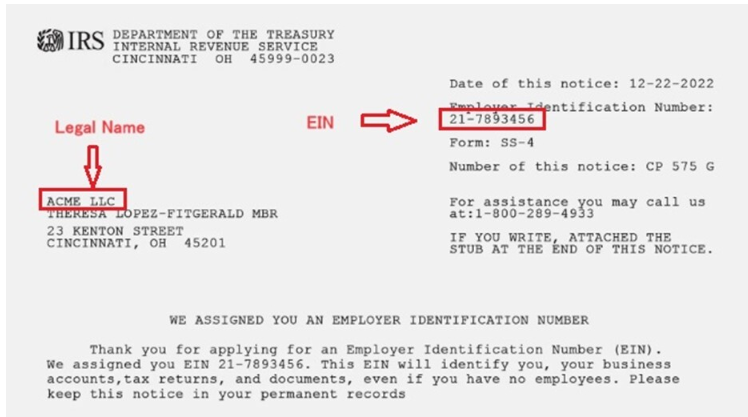](https://downloads.intercomcdn.com/i/o/ltcafuzd/2611860930/a613e25c89d1706261d8b19b2b9f/6c4f31e4-f9d9-4101-9352-352ce0e7a632?expires=1789491600&signature=702c998d7af48840ba5da4d89a23242353c781fc7a6e29ee92efeaa633e1cc26&req=diYmF8F4nYhcWfMW1HO4zfeG6UV66JMT%2BWhbVPJcth%2BWLAJSJ4BCY0KN0IIz%0APwAVg7EzbOaDKyYQqyg%3D%0A)

Example of Canada Provincial business registration document, see below:

[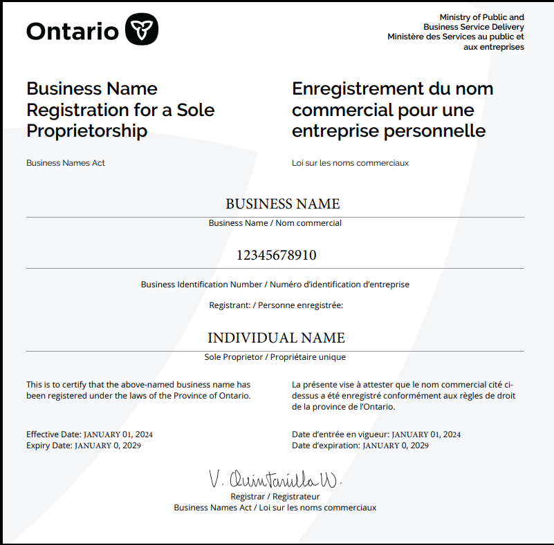](https://downloads.intercomcdn.com/i/o/ltcafuzd/2611860931/5b28f9501646b89ac2c4cf8fff03/3c008a15-7694-43ea-a513-38d3c906d456?expires=1789491600&signature=1e8e144de7c44abda32843434f0134ad54f8686981b913777ebd27bb97be1cba&req=diYmF8F4nYhcWPMW1HO4zXodVFf7Yt%2F67NZt1SGoX2XCa5xqGZR7u2U73r2V%0Au9qbNUFwAnoqqgTBF%2BE%3D%0A)

**Step 1.2 Corporate Website**

In the Corporate Website field enter the complete URL website link for the business.

[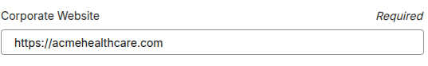](https://downloads.intercomcdn.com/i/o/ltcafuzd/2611860939/2b8b0a61e3ca9be57bdd0747dcea/f05c83aa-41b1-4323-8dee-36a76df4dbeb?expires=1789491600&signature=7bd719dd868ee3f58e83394d65bc3c7656b1f0737feec352a5fa6b1d8dc08376&req=diYmF8F4nYhcUPMW1HO4zfhh59D3mMpT%2B8BPVRb2si60kmyEvnlS9mZhOKpW%0AW9VF9lLsSFgJb0AKMFU%3D%0A)

**Step 1.3 Legal Entity or Organization Type**

In the Legal Organization field select the designated entity type of the registered business.

Example:

[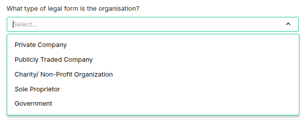](https://downloads.intercomcdn.com/i/o/ltcafuzd/2611860941/5c0e981a27655d967e4a5874f2e2/6adbaf9b-81a8-42fc-877b-d95d638d6f26?expires=1789491600&signature=68678d2109c9718e60ba04fa23a9aae61555c7fc1095e3019f9724fdc5b97d0d&req=diYmF8F4nYhbWPMW1HO4zSOkegfyvo07USPprayS8Q8f%2B1uo4EUujnEIrvyD%0AzIhi3pbT%2FjyswPEwPL4%3D%0A)

When selecting Sole Proprietor, you will notice the Business Registration Number and Business Registration Type fields will be automatically removed. These fields are not required for this entity type. See image below.

[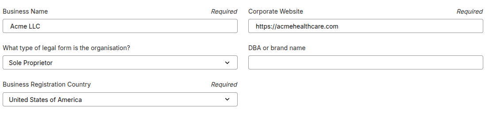](https://downloads.intercomcdn.com/i/o/ltcafuzd/2611860936/2f64e5e4fbd32800ae1efd7647b4/422d12cc-8495-43e9-a4c6-00b993f8d1d9?expires=1789491600&signature=05ee1e5fd1895269bad614a81f503f9fa93fe5cb380eea6089038ce64603fc9c&req=diYmF8F4nYhcX%2FMW1HO4zaJcohORLFQRF7SDU1MAjXs9kcC3t1rf3xqv02Wv%0ABYuvfq3mZSKPeTK7U1A%3D%0A)

When selecting Private Company, Publicly Traded Company, Charity / Non-Profit Organization, or Government entity types, the Business Registration Number and Business Registration Type fields are required.

In the image below, the Private Company organization type was selected along with the Business Registration Type of EIN.

[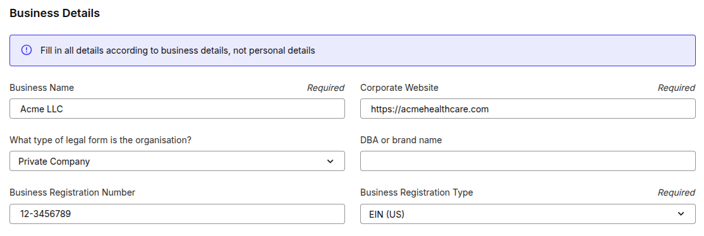](https://downloads.intercomcdn.com/i/o/ltcafuzd/2611860942/b3a4ee3668725a77f4b09a0ec9b0/a823bbf6-3449-4344-a495-69c3459fccad?expires=1789491600&signature=546db132c903bf1b4a3657f272a577e05128f5701b70f8e5a748e953f9b5e385&req=diYmF8F4nYhbW%2FMW1HO4zbKCVazFkLgC0DPgFudxEsUpDMUGLQlgOcpWOx0G%0Ay5imQYH5WPqWk7h1Ua4%3D%0A)

**Step 1.4 Business Registration Country**

Select the Business Registration Country. This will be the country the business is registered in. For sole proprietors this will be the country the business is operating in. See image below.

[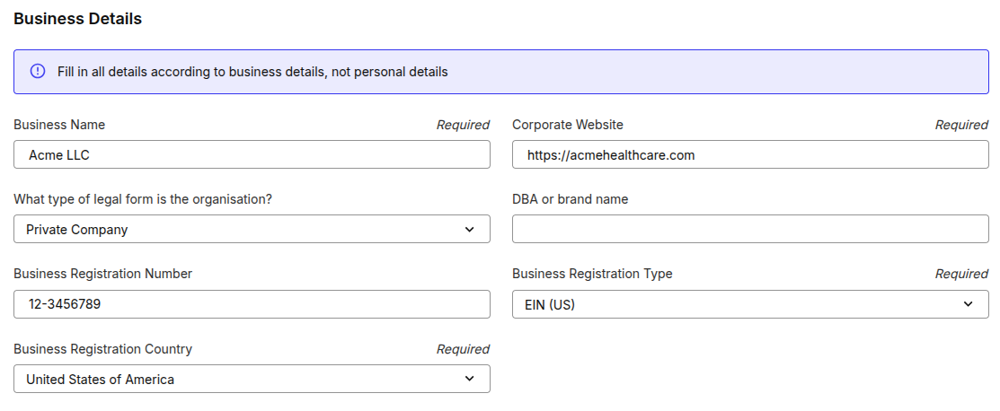](https://downloads.intercomcdn.com/i/o/ltcafuzd/2611860935/a2ac538f36545b0fd28642931fad/6cacf949-487d-4421-b19b-88954d5b4146?expires=1789491600&signature=94997e8c46b16e454a71f080ce63af1eb4b1e3a557e5724c71c4756b5cbd98e4&req=diYmF8F4nYhcXPMW1HO4zbLAO0dx1YgpPi5tow9%2F7S%2F5RPNiQtn3gYDct8Uv%0Aae0JCFPN8rAja4AHgA8%3D%0A)

**Step 1.5 DBA or Brand Name**

The doing business as name or brand name will be the branding throughout the rest of the toll-free submission. This is who the end user is opting into to receive SMS. See image below.

[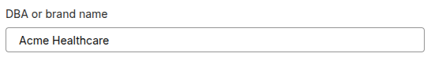](https://downloads.intercomcdn.com/i/o/ltcafuzd/2611860945/f2c935cee54e856f3cf232a474bc/e28539cb-be9b-4026-95e1-caddfebd324b?expires=1789491600&signature=c18c47254730e7a639cf0d6334935215d90ad10b46b969af695611972705e15c&req=diYmF8F4nYhbXPMW1HO4zQJpFFPdY72vceod%2BA7l4Ghi28GDDcgmfNR3CTUd%0ApVGqsGDvD3rj9rsmA28%3D%0A)

(Note: The DBA or Brand Name can be different from the Business Name.)

**Step 1.6 First Name, Last Name, EMail, & Phone Number**

Enter the business contact name, email address, and phone number. See image below.

(Note: This contact information should be on the About Page, Contact Page, or at the footer of the business website entered in earlier.)

[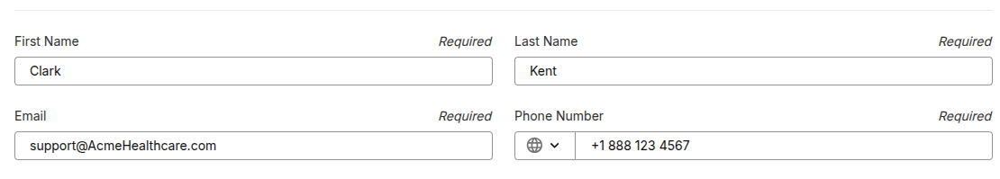](https://downloads.intercomcdn.com/i/o/ltcafuzd/2611860933/ee0a0c7ee8c260cec08cc7758e1d/3806bdb6-dac1-4172-b2c9-b4beb14b00ce?expires=1789491600&signature=b82c935a0fe68ed25b3e12d9ab8c3f13ec5d56d825a26c011c1b984632cf4d13&req=diYmF8F4nYhcWvMW1HO4zYwePpHKDwuEgCaOKwWXfgZnOWGPpLRlcFxu7VXF%0AeMmqSrXuR4ExCrGZeBA%3D%0A)

(Note: The email entered must be branded with the official website domain. If an unbranded email is used, it must be visible on the website.)

**Step 1.7 Status Update Webhook URL**

This field is optional, but if you enter a webhook link, the Telnyx API will send a post to the webhook link with a status update on the Toll-Free Submission. See image below.

**Step 1.8 Address**

Enter the physical business address of the brand or DBA. This can be different from the address on the legal business registration document. The address can be enetred manually or the search address tool can be used to automatically populate the fields. This address should be on the business website. See image below.

[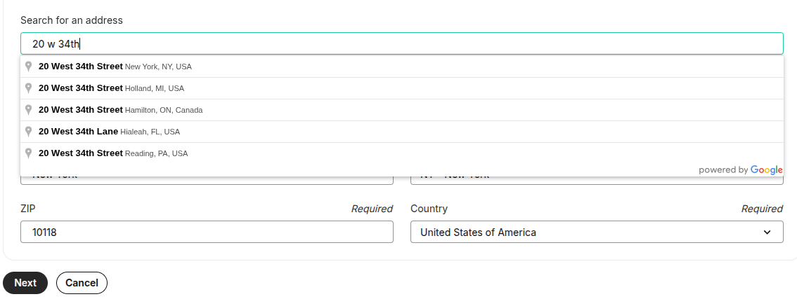](https://downloads.intercomcdn.com/i/o/ltcafuzd/2611860934/38c2b78e71295eea0dc36ba6008e/6da141f9-977d-4fdc-9fda-81425cd144d7?expires=1789491600&signature=40d85cecc3e8a2f5dd47ba9abb444a80ac97787f671cd403ea52b33f627dcb63&req=diYmF8F4nYhcXfMW1HO4zcZ3XU4%2B2A2L78gf8f7Juvr%2F9ABcoAcmHRCX6Nio%0A0iuFZeycoimfk4JLuvk%3D%0A)

The submission should look something like this below when this page is completed, Select Next and move to the Assign Numbers page.

[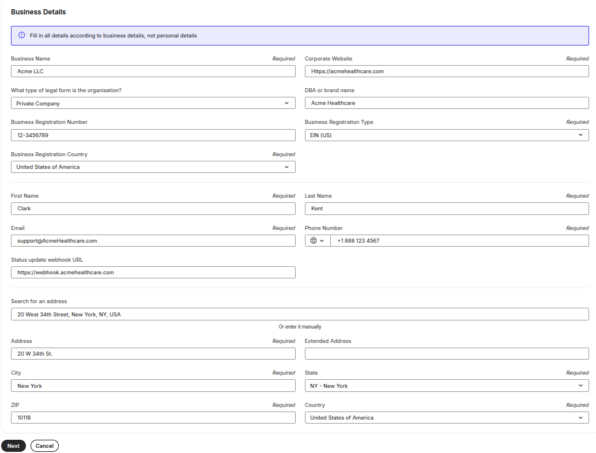](https://downloads.intercomcdn.com/i/o/ltcafuzd/2611860938/1d432eee7067374017c505e14556/cc258166-44ba-4aea-875d-2af39b2a7092?expires=1789491600&signature=f1178416d93e3d900936dcac403dba644968e3f3994f6f8bcecd5cadd62ec850&req=diYmF8F4nYhcUfMW1HO4zSP9Hw6ZmThlY8PC6wknXAbtQLxwSpCWEpfE47E6%0A2ZAp621UcHxDE4BU1nc%3D%0A)

**Step 2 Assigning a Number**

On this page, a list of toll-free numbers will appear. Select “Assign” to all the numbers you want to assign to the Toll-Free submission.

[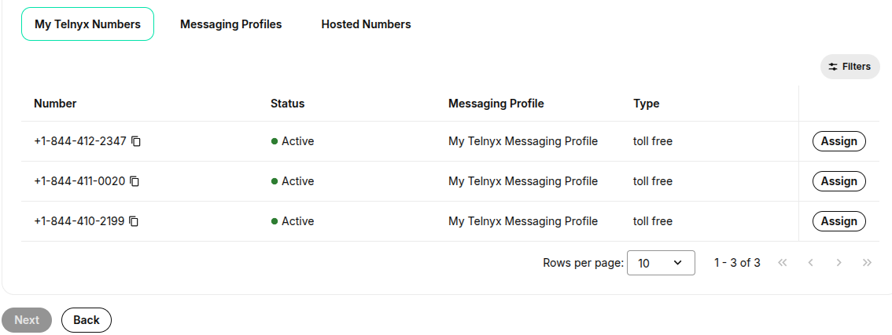](https://downloads.intercomcdn.com/i/o/ltcafuzd/2611860950/bddd8b23feb95d1fe252b488d844/b4deefd8-6bb7-43d1-a48e-be7b33f14cd2?expires=1789491600&signature=19100501002ba2d61ed42b036ab7d48871f920ab083a3a57c3b18b0cba6dfaa9&req=diYmF8F4nYhaWfMW1HO4zRIW%2BMDUCwQFHjPgez9y4HzEoKtaBMGB1qrKADLp%0ACkKyePv%2FbqtjSENYKmQ%3D%0A)

(Note: When submitting six (6) or more Toll Free Numbers in a single Verification Request, a valid explanation will need to be provided in the additional use case details field on why multiple numbers are needed.)

After assigning a Toll-Free number. See image below.

[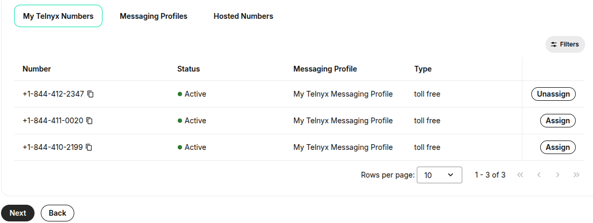](https://downloads.intercomcdn.com/i/o/ltcafuzd/2611860940/ded547afe02634e77204de5aca1e/e7d80e35-00c7-4650-8a4a-f06bdcf782af?expires=1789491600&signature=dbf09fe1872b08f2104b4ca28cf16372a28452f1437e74deb140f5b7d638ba3f&req=diYmF8F4nYhbWfMW1HO4zebmTa4egWJyIS2VzuSQisDusXHsfHaIVAmgOWr5%0A9KlkCIqRKJpMsYfsd8A%3D%0A)

(Note” If an error occurs here, “Toll-Free number not Provisioned.” This means that the number is not assigned to a messaging profile or it is still assigned to another carrier from a recent port or transfer of service prior to submission. If this error occurs please email [tfverifictaion@telnyx.com](mailto:tfverifictaion@telnyx.com) or [support@telnyx.com](mailto:support@telnyx.com) or open a chat via the Telnyx portal. Share a screenshot of the error and our team will escalate this issue to our messaging operations team.)

Select next and move onto the next page Use-Case Details.

**Step 3 Use Case Details**

This page is an explanation on why the Toll-Free SMS verification is needed.

[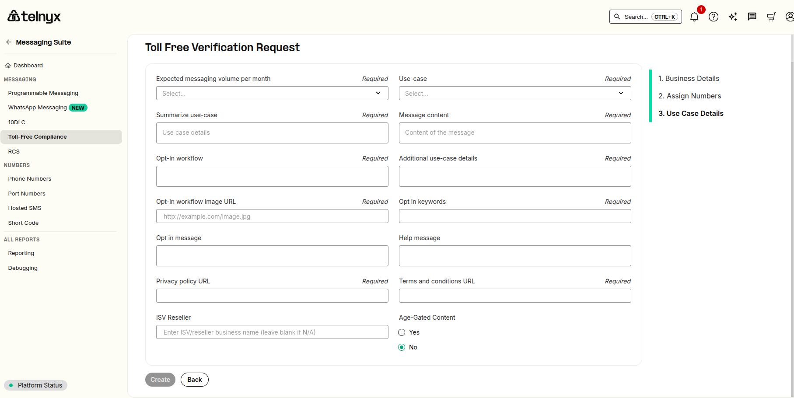](https://downloads.intercomcdn.com/i/o/ltcafuzd/2611860937/69d652a5c1cc75fce0c21c89c5ac/3e8315a7-ebe0-4028-94c5-8dfb6304e4b8?expires=1789491600&signature=2ed516715998b5fc18405a006ba4099a0890dc2f1408b1e76ec64c16642e0b73&req=diYmF8F4nYhcXvMW1HO4zbLbBQu15%2FzU3MmRvrFJ7nKnbg8BAmiyhpQpMiV5%0AetTfCA2QmMUVCCPj2mc%3D%0A)

**Step 3.1 Expected Messaging Volume Per Month**

This will be one of the following choices: 1,000, 10,000, 100,000, 250,000, 500,000, 750,000, 1M, 5M, 10M, or 10M+. See image below.

[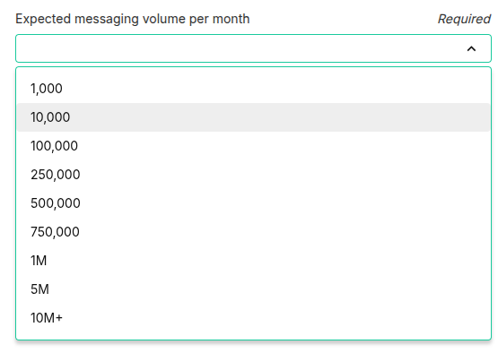](https://downloads.intercomcdn.com/i/o/ltcafuzd/2611860948/a7d40d9a9306d99af3658d713086/cad5918a-994b-4507-859a-ba16d8952f58?expires=1789491600&signature=5bd62cd51e3f8c7a395b348b807a985a6f847c2ba90de9f2f34e91f5ee5f6870&req=diYmF8F4nYhbUfMW1HO4zWn%2F78P4aSI5Tz4GmKFjvSza0sH9dg3RdlgyQzGM%0A%2F9vfbs8hLoSCDteuhME%3D%0A)

When choosing a monthly messaging volume, select what the projected volume will be scaled at after 6 months of onboarding.

(Note: If your Toll-Free number is verified for one of the messaging volume choices above, and you need the messaging volume increased later. The verified Toll-Free number and Request ID will have to be resubmitted in order to increase the messaging volume. This means the number will need to be taken offline while being re-verified and be unable to send SMS. If this is the case, please contact our team and we will expedite the process. The other option would be to submit a new identical submission with a new Toll-Free number with a higher messaging volume.)

**Step 3.2 Use Case**

Select a Use Case. Below is a list of Use Case choices.

[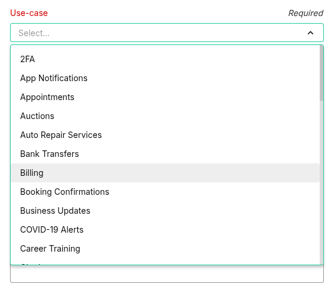](https://downloads.intercomcdn.com/i/o/ltcafuzd/2611860946/d09b47077a52a5a459bf1f731e67/6a840609-50a6-43e5-bf7e-fae43778826b?expires=1789491600&signature=2a8dea31f7285080c6e37fc805ac064338b9e2b524b1a486be9f0be47536861c&req=diYmF8F4nYhbX%2FMW1HO4zWBQE86GzuYE95mwxwFcYMsVupyX4tI8%2FHzTqdbU%0Al9OGGZm%2FIQu6s%2FAfn%2FQ%3D%0A)

**SMS Use Cases:**

2FA

App Notifications

Appointments

Auctions

Auto Repair Services

Bank Transfers

Billing

Booking Confirmations

Business Updates

Career Training

Chatbot

Conversational/Alerts

Courier Services & Deliveries

Emergency Alerts

Employee Alerts

Events & Planning

Financial Services

Fraud Alerts

Fundraising

General Marketing

General School Updates

HR/Staffing

Healthcare Alerts

Housing Community Updates

Insurance Services

Job DIspatch

Legal Services

Mixed

Motivational Reminders

Notary Notifications

Notifications

Order Notifications

Political

Public Works

Real Estate Services

Religious Services

Repair and Diagnostic Alerts

Rewards Program

Surveys

System Alerts

Voting Reminders

Waitlist Alerts

Webinar Reminders

**Step 3.3 Summarize Use-Case**

This field is also known as the use-case summary. This will explain what SMS is being sent and who is sending it. See example below

If only one of the listed Use Cases needed is such as Conversational/Alerts, then only this Use Case will be listed in the Use-Case Summary. See the example below.

Example for Use Case: Conversational/Alerts

Use-case summary

Campaign to send transactional text messages for Conversational/Alerts from Acme Health Care.

[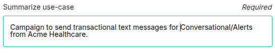](https://downloads.intercomcdn.com/i/o/ltcafuzd/2611860943/46418ca2bef8cbdd3d6ef5b8640e/989901da-1eb1-4095-9288-f7aaa940a5e8?expires=1789491600&signature=edb98f0e01168ab78bee4a09009dc952954c7af83e24363b158e5f09bb740c81&req=diYmF8F4nYhbWvMW1HO4zScnocuZ1uF%2BcvYJShw1AX5eCq8kydaN3t48D5BM%0AzZs2d6xMRxcOiU93c2k%3D%0A)

If any two or more of the listed Use Cases are needed, the selected Use Case will be MIxed. Then all needed use case types will be explained in the use-case summary.

See the example below for a company named Acme Health Care with a Mixed Use Case for 2FA, Conversational/Alerts, and Appointments. Each use case is listed in the Use-Case Summary.. See example below.

Example:

Use-case summary

Campaign to send transactional text messages for 2FA, Appointments, and Conversational/Alerts from Acme Health Care.

[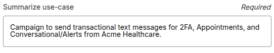](https://downloads.intercomcdn.com/i/o/ltcafuzd/2611860947/ce00e33769ebe7f1216979717f1d/8b12f43c-7f6b-48d2-a081-943ae83841b4?expires=1789491600&signature=08968ec39f922d1d941cf328cd6f46883aec83305ce897b8bc3e7d3b600b70e0&req=diYmF8F4nYhbXvMW1HO4zRdvlgZTCfzPu%2F2tMDZsEdGDQ5YMjhgNLEtNkW6J%0ACTCo145WatWe6DEl%2Bgg%3D%0A)

If this same company also needed a General Marketing Use Case for SMS, then this would be added to the Use-Case Summary field in addition to the previously needed Use Cases.

See the example below for a company named Acme Health Care with a Mixed Use Case for 2FA, Conversational/Alerts, Appointments, and General Marketing. Each use case is listed in the Use-Case Summary. See example below.

Example:

Use-case summary

Campaign to send transactional text messages for 2FA, Appointments, Conversational/Alerts, and Marketing & Promotional SMS from Acme Health Care.

[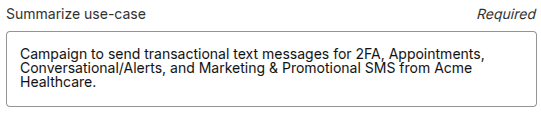](https://downloads.intercomcdn.com/i/o/ltcafuzd/2611860949/1ba8b6610e931b3a049f6bbfde53/8371749f-8f95-46f0-a000-3d386bdbaa79?expires=1789491600&signature=62a24de5c85469269589f5aa3a0e737bdce276982a4b9c565b676bf675cfeabe&req=diYmF8F4nYhbUPMW1HO4zS1h5YlfHm1xZ8WbUrKRSA5Za6gba93CdeRohVBv%0A%2FzK40bQUnHQ%2B2gUkmHY%3D%0A)

**Step 3.3 Message Content**

In this field please list 2-3 sample messages. Please exclude any special characters and do not leave spaces between messages. The message must be branded with the DBA/Brand Name. Please email [tfverification@telnyx.com](mailto:tfverification@telnyx.com) if you would like message examples for each use case.

[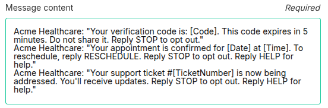](https://downloads.intercomcdn.com/i/o/ltcafuzd/2611860952/9c0ebf83f1d138ff28672cd4a800/39c0d528-fd1c-40ca-8433-47070794e3ea?expires=1789491600&signature=f869e46a44edf355b00acc18c1a32fdab28f4e039101bad667482401649e063a&req=diYmF8F4nYhaW%2FMW1HO4zZ7p%2Bhu9tsqr%2F4f2Q8Cl9GJTbAWaRn8mO%2FF1ZOxH%0AwY%2FJ%2FQZGysjy%2FpKckus%3D%0A)

**Step 3.4 Opt-In Workflow**

This field is just a designation of the opt-in type. Opt-In workflow will be one of the following: Digital Opt-In, Written Opt-In, Verbal Opt-In, or Inbound Keyword Text. No other information is needed in this field.

[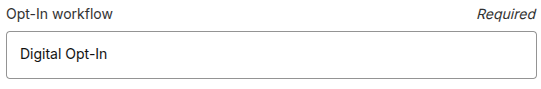](https://downloads.intercomcdn.com/i/o/ltcafuzd/2611860951/79b392665180a67b8583daabb50c/e3b7afec-80e1-4d9b-adea-c544bfe063d1?expires=1789491600&signature=a9ad69d9b7d65893a8163e516d565eda9d8e015d6d707aec8742103612f78974&req=diYmF8F4nYhaWPMW1HO4zUXwXL6b6DvXd40wMefyS7DXjt2H3HmDkogJTJ7%2B%0AUqVKwpA7BVdc%2Bd4AtFI%3D%0A)

**Step 3.5 Additional Use-Case Details**

This field is optional. This field is for non-designated use cases such as Testing. If no additional use-cases are needed just place N/A in this field.

[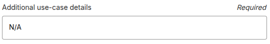](https://downloads.intercomcdn.com/i/o/ltcafuzd/2611860954/17f2320ab39938dd407f8c2cc2f8/56bb89cb-8c14-4e4c-91b4-823bf2de0e3b?expires=1789491600&signature=c28c65ae6d7ace4c5d8a8529523be28d8dadf3e57ce688b9091c7dc963c0cf4b&req=diYmF8F4nYhaXfMW1HO4zZGGMDo8yMgRaXIuLdRpdhYNGUI9Vgz4fDCrmITe%0AoBbS9e%2Fhy4VnTfGiitE%3D%0A)

[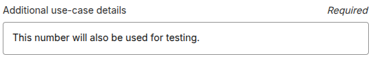](https://downloads.intercomcdn.com/i/o/ltcafuzd/2611860953/d3724678f414d76187de33941171/f756605a-9128-4763-ad09-2b6faa586959?expires=1789491600&signature=6a17f5745f9182b37fb4cbab768f4ab59f4766f3596a2a008feae5f4317cc49f&req=diYmF8F4nYhaWvMW1HO4zTQtaH1nN%2BKe3ikCFz0SQUbTIzHIVJGYdtn77VRZ%0A5mwUMjBi2IZBsx8dMRo%3D%0A)

**Step 3.6 Opt-In Workflow Image URL**

The opt-in method is a critical component of registration. In this field a link to the opt-in is required. This will be a link to a website page, a Google Doc, or an embedded link from a hosting site. These links must be public.

Example 1: Digital Opt-In - Mixed use case for 2FA, Appointments, and Conversational/Alerts.

[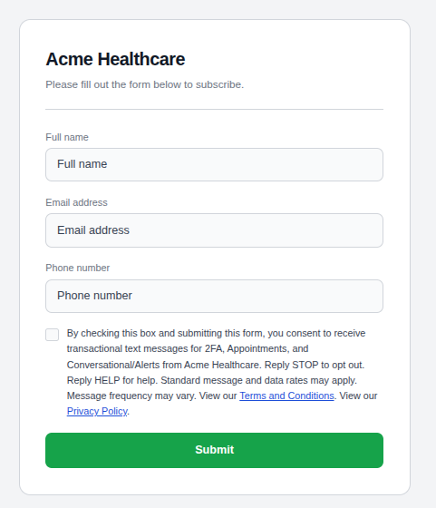](https://downloads.intercomcdn.com/i/o/ltcafuzd/2611860955/829eb4694115e516d573b4f6dd92/6f53c380-1b3a-4c8b-b816-05bb96cfc906?expires=1789491600&signature=94fc07a94c54645aca2d8c8db1739d519f793ae52fffe29dcd02527cb10526cc&req=diYmF8F4nYhaXPMW1HO4zWLO%2BsFeGdvuWqjcHQoVg6EQg6oEXcVvofLjvVL%2F%0AWndnIA89wwbzOgb32GA%3D%0A)

Example 2: Digital Opt-In - MIxed use case for 2FA, Appointments, Conversational/Alerts, and Marketing & Promotional.

(Note: A Marketing & Promotional SMS opt-in must have an opt-in disclosure of its own with a compliant checkbox separate from the other use cases.)

[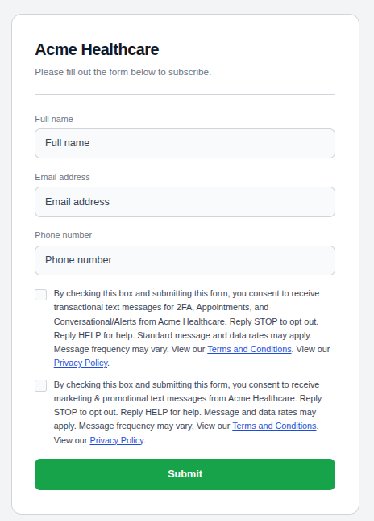](https://downloads.intercomcdn.com/i/o/ltcafuzd/2611860956/b2ec73d8c83eaec846d054c32951/bb10668b-a030-4e48-b714-f40181c4dc10?expires=1789491600&signature=bcf97201dc40f43556acbe22f1c5705352a4d8b1f0d4f2313b1419c804e46f98&req=diYmF8F4nYhaX%2FMW1HO4zRIODJMWAHEI4cTFpjPElzFFSP0rdtvsTwK%2BD6CY%0AzYYdw7Ki5HgPAjTsX7g%3D%0A)

Example 3: Verbal Opt-In - Mixed use case for 2FA, Appointments, and Conversational/Alerts.

This is a verbal conversation between the business representative and the customer. See below.

[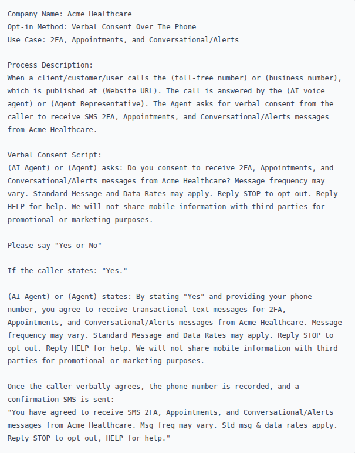](https://downloads.intercomcdn.com/i/o/ltcafuzd/2611894564/d3fcba99c8699a9d3cf77cb7cace/8830ee00-bbe8-4eea-bd03-4e7ad5fca8f1?expires=1789491600&signature=149b5944621f62d55c1f15a65007511a19ca7420971f407478ee925027215424&req=diYmF8F3mYRZXfMW1HO4zSWvJTwtDKKvUtwm6IVqCQ3sRj44nUByNHlea5NZ%0APURuJ2XLyqAl4%2FvEWJw%3D%0A)

Example 4: Verbal Opt-In - Mixed use case for 2FA, Appointments, Conversational/Alerts, and Marketing & Promotional.

(Note: Marketing & Promotional SMS can only be added to verbal opt-in via a Double Opt-In method.)

[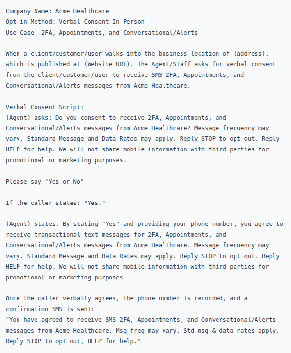](https://downloads.intercomcdn.com/i/o/ltcafuzd/2611894570/ee23c5c4a79755d1b3cf69172372/af2d564b-69e9-4770-877a-e1057c384a51?expires=1789491600&signature=ab1ebaf2e5ffbe403e60b49024548079598c922be5b30ee9659af7228d534035&req=diYmF8F3mYRYWfMW1HO4zftlll7ZRjFb4xWHeJF%2Bw4BDkNGidrdYeGEmgJ4A%0AfYsLCyJDgVATUOWeQxQ%3D%0A)

Example 5: Written Opt-In - Mixed use case for 2FA, Appointments, and Conversational/Alerts.

[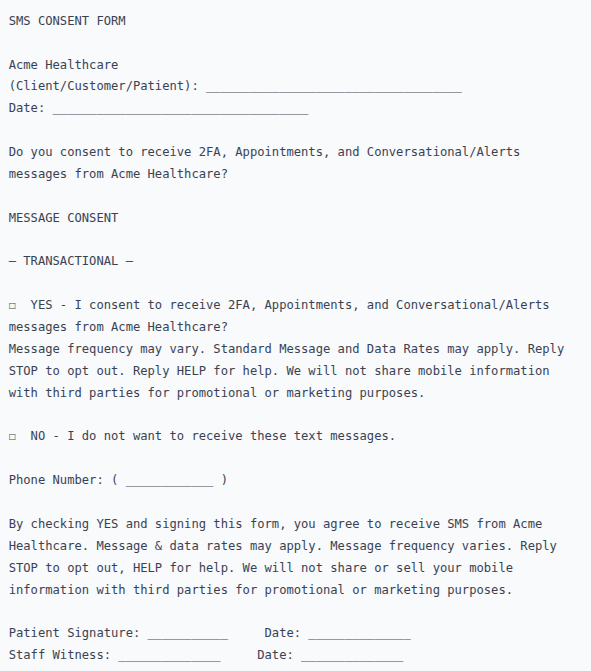](https://downloads.intercomcdn.com/i/o/ltcafuzd/2611894563/fa82e28fd973242ced90c8e5163c/57a6cb0c-0e2e-4d04-96d8-49b5a4f1efd8?expires=1789491600&signature=fb2ed5c669371281304d2719fdf895c3fcfd586a6a83d784326c353e9233bf88&req=diYmF8F3mYRZWvMW1HO4zUGQm1ktwzzBn3BbLgvTdIFOD%2FqbkLwzUdapBL0H%0ADHALYgd%2FwcLVT8FrD%2FI%3D%0A)

Example 6: Written Opt-In - MIxed use case for 2FA, Appointments, Conversational/Alerts, and Marketing & Promotional.

[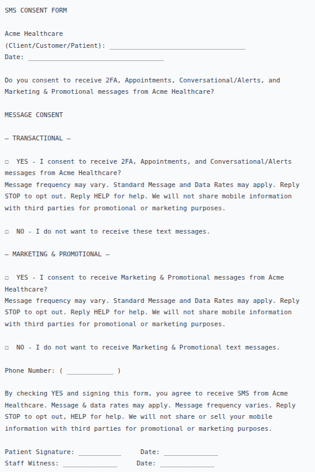](https://downloads.intercomcdn.com/i/o/ltcafuzd/2611894566/6854cffa1d4fc1e36a01e3829c00/0f2dfae3-184c-4bbb-bcea-ebb508c67fdc?expires=1789491600&signature=12e44fdea9458d5f65b8e1337c395e06164aa25d123e0b8d612410d7a0aa2b63&req=diYmF8F3mYRZX%2FMW1HO4zcV4tw7IqNDfy276gPYBbcLHq4jPp1d2tlm2Wg%2FT%0AefddpFr%2BLdGT7xn7dEE%3D%0A)

Example 7: Inbound Keyword Text

Transactional SMS example opt-in

[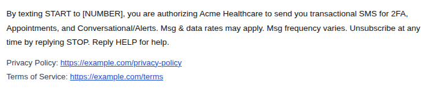](https://downloads.intercomcdn.com/i/o/ltcafuzd/2611894567/ea511ed27a8c0a7dee8e688c2522/e4ad2b19-42b2-4826-883c-5b51f85ba922?expires=1789491600&signature=e8c693b685a91a96df09994314927f5903f674b0db6e5b35c5739437e0e2097c&req=diYmF8F3mYRZXvMW1HO4zXkSOWaq2CbEXWxvC6%2FEbNXwjU84u0bODtVs6BAk%0A8XxjgcYfjW09C2bg4Fg%3D%0A)

Marketing & Promotional SMS example opt-in

[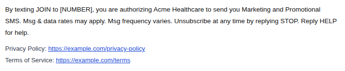](https://downloads.intercomcdn.com/i/o/ltcafuzd/2611894569/68c5707f266414778a605233b6b4/a4cd9b7c-8a12-4ec4-951b-92f17d4df1a7?expires=1789491600&signature=04ae8529f317d52f23f5e7f4604b3ba6c9f2d0669b9843a1f1163337d40b6901&req=diYmF8F3mYRZUPMW1HO4zcvpvSkS9JQ8YQS5DuNRnsPwcq2FjYxCR8UJvh90%0A31ha9mHxBlZ0uXv%2FUoM%3D%0A)

Example 8: QR Code

**Acme Healthcare Alerts**

**Scan to JOIN**

To Receive Promotions, Product Updates, and Special Offers from Acme Healthcare. Message and data rates may apply. Msg frequency varies. Unsubscribe at any time by replying STOP. Reply HELP for help.

Privacy Policy: <https://example.com/privacy-policy>

Terms of Service: <https://example.com/terms>

**Step 3.7 Opt-In Keywords**

In this field the Opt-In keywords can be listed. These will be opt-in keywords specific to your opt and can be unique. If your opt-in does not have an opt-in keyword, then simply put N/A in this field for (not applicable)..

[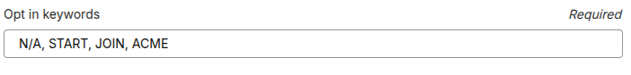](https://downloads.intercomcdn.com/i/o/ltcafuzd/2611940419/2957fa17f929371086b82b296e41/image.png?expires=1789491600&signature=96ff589b0670e1741138de2f5ea8174a23d3ae3974e3065d192a4f2df9f22faf&req=diYmF8B6nYVeUPMW1HO4zRXF%2BeQVclyknnBzU%2B%2BvVke%2BpDSrJmS18a8bL4En%0AdQDrdFwAdc2PV7AdclA%3D%0A)

(Note: START/UNSTOP and STOP Keywords are by default programmed into your Telnyx messaging profile. The Default Telnyx messages are below. These messages can be edited in the Keywords Management section of the numbers assigned messaging profile.)

STOP: NETWORK MSG: You replied with the word "stop" which blocks all texts sent from this number. Text back "unstop" to receive messages again.

START/UNSTOP: NETWORK MSG: You have replied "start/unstop" and will begin receiving messages again from this number.

**Step 3.8 Opt-In Message**

This will be the confirmation message that is sent to the SMS recipient upon opting in.

Example:

[Brand name]: Thanks for subscribing to [use case(s)]! Reply HELP for help. Message frequency may vary. Message and data rates may apply. Consent is not a condition of purchase. Reply STOP to opt out.

**Step 3.9 HELP Message**

This will be the response that is sent to the SMS recipient requesting help. This should include one of the following contact methods of the business; phone number, website link, or email address.

Example:

[Brand name]: Please reach out to us at [website/email/phone number] for help.

[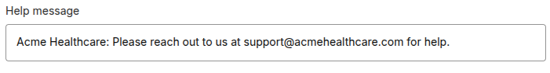](https://downloads.intercomcdn.com/i/o/ltcafuzd/2611960994/ae530066978eeb62c55fa8aee1ea/6ff687b3-46ab-46e8-b3e9-025a223bde08?expires=1789491600&signature=1232c4ec735852976ec6d6cc315f67674154ee4d64fa95484bc2a9abe1e80160&req=diYmF8B4nYhWXfMW1HO4zWNghn9mTKSQ9N18YQ1YUpNlpcGzHJVWk6vgbgvf%0AQ81QBF3FSFSvZjW%2BLiE%3D%0A)

(Note: By default Telnyx does not send this message in response to the Keyword HELP. This will need to be added to the Keywords Management section of the numbers assigned messaging profile. See example below.)

[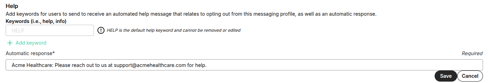](https://downloads.intercomcdn.com/i/o/ltcafuzd/2612284261/3f77828144ae81b48906b8eb4037/3783b7e2-fcdd-44b9-8219-8107df772a06?expires=1789491600&signature=3f181cf2f225f9456b18f26e5bbcd9c8ca5cbfa726824a70b75feda8d0f169df&req=diYmFMt2mYNZWPMW1HO4zSAuSM1pKknZYWeiO6mI2KvTniFHtn%2Bv7SR4C90q%0AphcYL3ZEfqd3ypDtXa0%3D%0A)

**Step 3.10 Privacy & Terms Links**

In these two fields links to the website Privacy Policy and Terms & Conditions pages are required.

(Note: The Privacy Policy must contain the following statement to be compliant.

No mobile information will be sold or shared with third parties for promotional or marketing purposes.)

[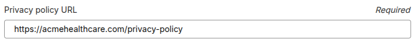](https://downloads.intercomcdn.com/i/o/ltcafuzd/2611960996/077314279809b24b6e92f7155f62/34f21c73-9789-463f-9f01-c4fadc4d748e?expires=1789491600&signature=96cb03247efd5d35b49a287e39bd00b6379e08e0e2ded4f512494eb50d8521b7&req=diYmF8B4nYhWX%2FMW1HO4zZxjLeZRojVvWBErY%2BSVh3NBZ56p4TTsilYSRddL%0AOqqtamNqZe7toXDGPdM%3D%0A)

[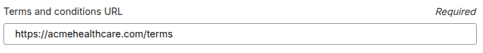](https://downloads.intercomcdn.com/i/o/ltcafuzd/2611960995/0015024b2e9ddbabadf22c6a305c/98916fca-8b75-4aea-a33c-71d493353417?expires=1789491600&signature=6b1eaf5bf250d28b0eac95981032406b4e03d040a6b60fa589e21e8b2f9bc9e0&req=diYmF8B4nYhWXPMW1HO4zaYybg%2FhB9a7b4LN9rWSB9G76lmwoGqyyVCWtU8d%0A%2BU6TT%2BAKgaGkO%2BQR8j4%3D%0A)

---

Related Articles

- [Toll-Free Messaging](https://support.telnyx.com/en/articles/5353868-toll-free-messaging)
- [Toll-Free Opt-Out Words](https://support.telnyx.com/en/articles/6989758-toll-free-opt-out-words)
- [Toll Free Verification Request Guide](https://support.telnyx.com/en/articles/10729979-toll-free-verification-request-guide)
- [How to Pick a Toll Free Use Case](https://support.telnyx.com/en/articles/12650709-how-to-pick-a-toll-free-use-case)
- [Toll-Free Carrier Rejections](https://support.telnyx.com/en/articles/15138019-toll-free-carrier-rejections)
