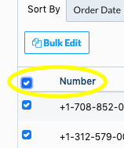
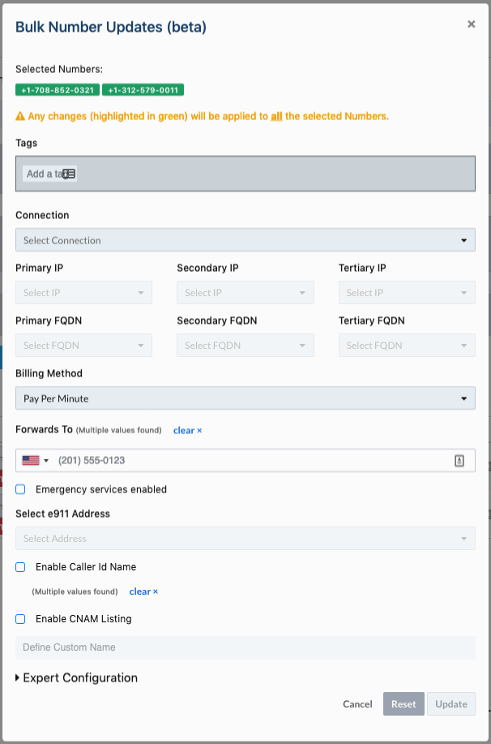

# Bulk Edit Numbers - Call Forwarding

## Guide to Editing Your Numbers for Call Forwarding

**Step 1 :** Login to your Telnyx Mission Control account

**Step 2 :** Click on the NUMBERS on the top left side of the page

**Step 3 :** Click on MY NUMBERS tab

**Step 4 :** Mark the checkboxes for the numbers you'd like to edit

**Step 5 :** You can also select all the number on using the checkbox listed above the top number (highlighted in yellow).

**Step 6 :** Once you have selected your desired numbers, click on the Bulk Edit button above the number checkbox.   
​  
​**Step 7 :** A new window will pop up with heading **Bulk Number Updates (beta).**

**Step 8 :** Click on Forwards to option & add the desired number where you want to forward your calls to. You can also choose between always or on failure for your call forwarding scenario.  
​  
​**Step 9 :** Click on update and the desired call forwarding number will be assigned to your selected numbers.

## Video Walkthrough - Editing numbers for call forwarding

[Watch video](https://www.loom.com/embed/0c8b46319d4845c7b238e8da4539520c)

**PLEASE NOTE:** This is a bulk edit function and any changes you make will be applied to all of the numbers you have selected.

---

Related Articles

- [Call Forwarding](https://support.telnyx.com/en/articles/1130657-call-forwarding)
- [Bulk Edit Numbers - Voice Settings](https://support.telnyx.com/en/articles/2807846-bulk-edit-numbers-voice-settings)
- [Bulk Edit Numbers - Emergency Services](https://support.telnyx.com/en/articles/2819213-bulk-edit-numbers-emergency-services)
- [Bulk Edit Numbers - Delete Numbers](https://support.telnyx.com/en/articles/2819236-bulk-edit-numbers-delete-numbers)
- [Bulk Edit Numbers - Messaging Profile](https://support.telnyx.com/en/articles/2819238-bulk-edit-numbers-messaging-profile)
