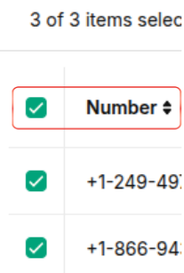
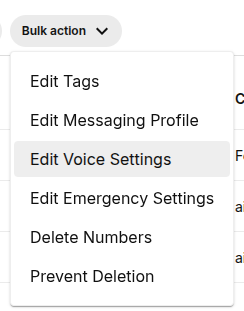
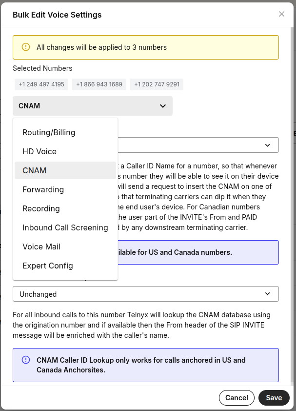
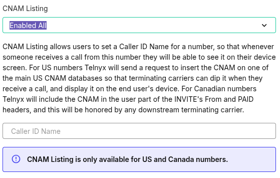

# Bulk Edit Numbers - Caller ID (inbound)

## **Guide to Adding Caller ID to your Inbound Numbers**

**Step 1 :** Login to your Telnyx Mission Control account.

**Step 2 :** Click on the "Real-Time Communications" on the top left side of the page.

**Step 3 :** Click on "Numbers" tab and then "Manage Numbers" tab to go into "My Numbers".

**Step 4 :** Mark the checkboxes for the numbers you'd like to edit.

**Step 5 :** You can also select all the number on using the checkbox listed above the top number (highlighted in red).

**Step 6 :** Once you have selected your desired numbers, click on the "Bulk action" button above.   
​  
​**Step 7 :** A new window will pop up, click on "Edit Voice Settings" and select "CNAM".

**Step 8 :** Click on "Enabled all" & fill out the name you want to display while making calls in the Define custom name field.

​  
​**Step 9 :** Click on "Save" and the desired caller ID will be updated for all your selected numbers.

**PLEASE NOTE:** This is a bulk edit function and any changes you make will be applied to all of the numbers you have selected

---

Related Articles

- [Caller ID Outbound vs CNAM](https://support.telnyx.com/en/articles/1130720-caller-id-outbound-vs-cnam)
- [Bulk Edit Numbers - Voice Settings](https://support.telnyx.com/en/articles/2807846-bulk-edit-numbers-voice-settings)
- [Bulk Edit Numbers - Emergency Services](https://support.telnyx.com/en/articles/2819213-bulk-edit-numbers-emergency-services)
- [Bulk Edit Numbers - Messaging Profile](https://support.telnyx.com/en/articles/2819238-bulk-edit-numbers-messaging-profile)
- [Your Number Lookup Guide](https://support.telnyx.com/en/articles/4366901-your-number-lookup-guide)
