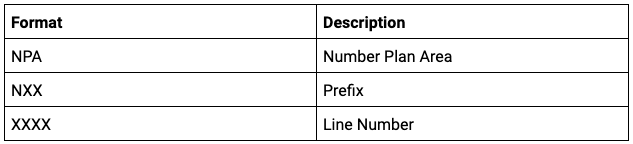
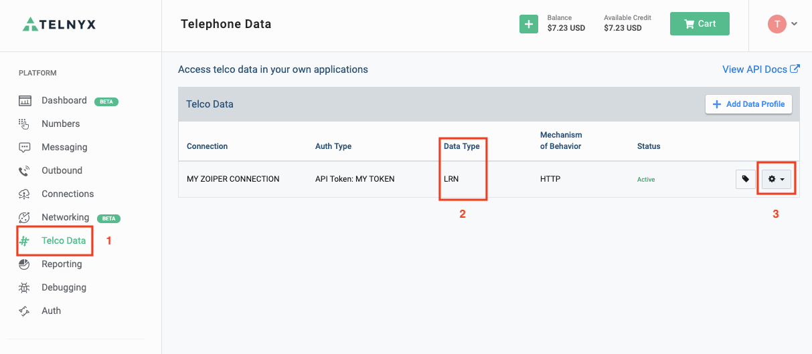
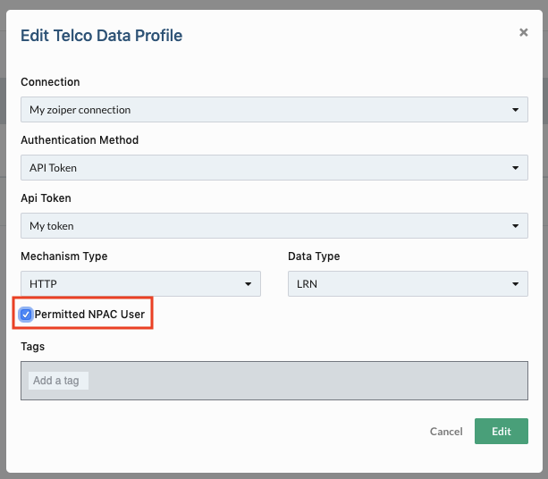

# Migrate Your LRN Lookup API from v1 to v1.1

We’ve released a new version of the LRN Lookup API (version 1.1), which is now able to return NPAC ten-digit numbers.

## **A quick recap of the format of an LRN:**

[](/_images/dc1ef04ecb45429e6766a0a7e3e4e94735db414669a298649ad68fc9e2f7030c.png)

- N can be any number from 2 to 9
- P, A, can be any number from 0 to 9
- X can be any number from 0 to 9

## **What’s changed in v1.1:**

- The version in the URI path has changed from v1 to v1.1
- The response in v1.1 is always a 10 digit number (NPA-NXX-XXXX), in v1 it was a 6 digit number (NPA-NXX)
- If you are a customer of NPAC, the response will be the full 10 digits.
- If you aren’t a customer of NPAC, the response will be the same first 6 digits as in v1 and then we’ll pad the final 4 digits with 9999.

## **Examples**:

## LRN lookup using the v1 API

## Request

GET <https://lrnlookup.telnyx.com/v1.1/LRN/2028172699>

## Response

```
{"tn":"1234567890", "lrn":"301710"}
```

## LRN lookup using the v1.1 API if you aren’t a customer of NPAC

In this case you just need to update the request API and check that you are able to handle the updated response for the LRN value.

## Request

GET <https://lrnlookup.telnyx.com/v1.1/LRN/2028172699>

## Response

```
{"tn":"1234567890", "lrn":"3017109999"}
```

## **LRN lookup using the v1.1 API if you are a customer of NPAC**

1. Sign into the [Telnyx Mission Control Portal](https://portal.telnyx.com/).
2. Select“Telco Data” from the left-hand side navigation (see 1 below)
3. Identify the LRN Lookup connection that you’re using from your list of Telco Data connections (see 2 below).
4. Select the settings icon on the right-hand side and from the dropdown click on “Edit Profile” (see 3 below).

[](/_images/be507ae94e6047c9577fc3a5d2513a68b274450622ad32b6aaabde8ab5e1083b.png)

5. Next, check the “Permitted NPAC User” checkbox

[](/_images/b64aa624fdf65325b2d9ea6343bfbfe7b2f21a30539186dce740ed83fa4c1db3.png)

6. Finally, update the request API and check that you’re able to handle the updated response for the LRN value.

## **Request**

GET <https://lrnlookup.telnyx.com/v1.1/LRN/2028172699>

## **Response**

```
{"tn":"1234567890", "lrn":"3017106199"}
```

That’s it. You’re all set to start using the new version of the API.

​
