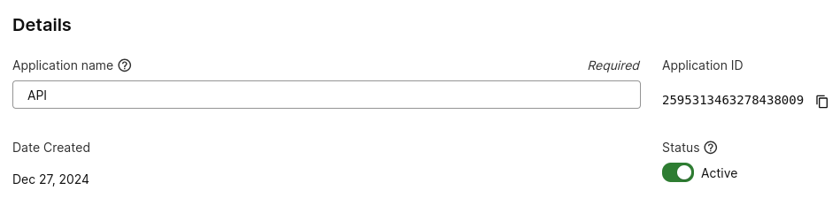
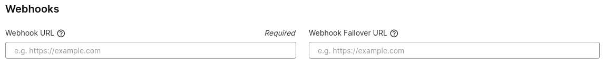
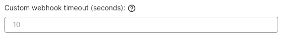
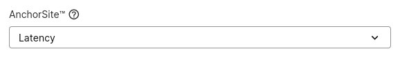
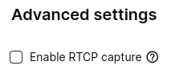
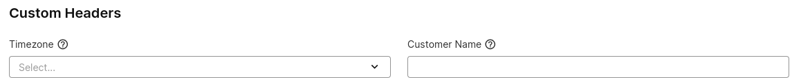
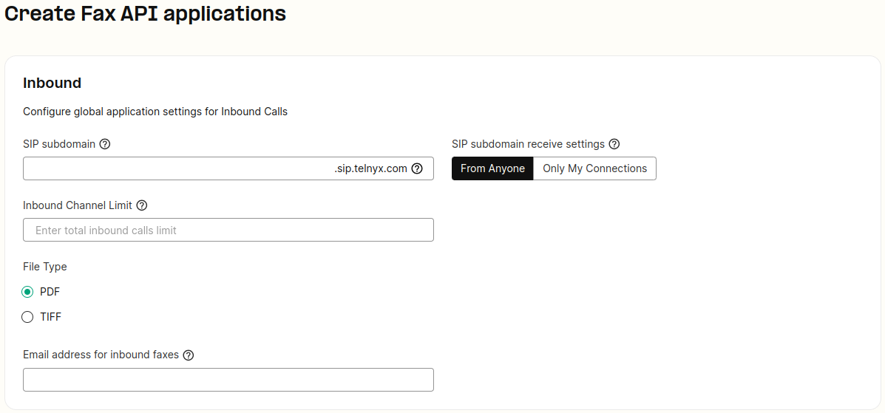
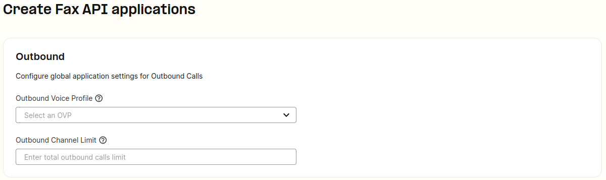
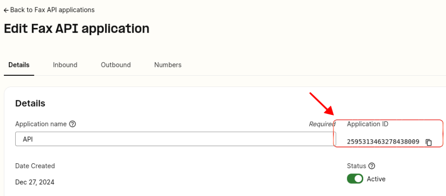

# Configuring Programmable Fax Applications

This article describes the in-depth setup of Programmable Fax / Applications on your Mission Control Portal in order to send and receive faxes via our API.

## Configuration of Programmable Fax

The [Programmable Fax](https://portal.telnyx.com/#/app/fax/applications) applications section is located on the left hand side of the portal.

Click on this button below and it will directly get you to the Programmable Fax Applications page.

[Programmable Fax Applications](https://portal.telnyx.com/#/app/fax/applications)

## Step By Step Guide to Programmable Fax

There are 4 sections which you can configure:

1. ***App Info***
2. ***Custom Settings***
3. ***Inbound Settings***
4. ***Outbound Settings***.

## Fax Application Settings

## App Name

Click on " Create your first application" and assign a name to this application to better manage the application. You also have access to the quickstart guide on the top right as well as the Application ID which will be required for API Interactions.

## Send a webhook to the URL

You will need to input a URL where all the [webhook](https://support.telnyx.com/en/articles/4334722-how-to-leverage-webhooks) events will be sent. Also, you can setup a fail-over URL. If two consecutive delivery attempts to the primary URL fail, Telnyx will attempt delivery to this URL. **NOTE**: Must include a scheme such as 'https'.

## Custom webhook timeout (seconds)

Specify time, in seconds, for Telnyx to wait for a response to a webhook request.

​

## AnchorSite® Selection

"Latency" directs Telnyx to route media through the site with the lowest round-trip time to the user's connection. Telnyx calculates this time using ICMP ping messages. This can be disabled by specifying a site to handle all media.

## RTCP Capture

Enable capture of RTCP reports to build QoS Reports (found under Debugging > SIP Call Flow Tool)

---

## Custom Headers

Specify the timezone and customer name which will be included in your programmable outbound faxes on the recipients side.

## Inbound Settings

You can configure your global application settings for inbound calls over here.

## Subdomain

Specify a **subdomain** that can be used to receive calls to a Connection, in the same way a phone number is used, from a SIP endpoint.

- Example: the subdomain "**example**.sip.telnyx.com" can be called from any SIP endpoint by using the SIP URI "sip:@**example**.sip.telnyx.com" where the user part can be any alphanumeric value.
- You only need to specify the subdomain in this field, there is no need to specify a Telnyx domain after it.
- **SIP subdomain receive settings**: In this field, either you setup your receive SIP subdomain connection from anyone or only connections.

## Inbound Channel Limit

You can limit the total number of inbound calls to phone numbers associated with this connection.

## File Type

Specify whether you want Telnyx to deliver your inbound faxes as a PDF or TIFF file type.

---

## Outbound Settings

## Outbound Voice Profile

Assign your application to an outbound voice profile in order to make outbound calls.

## Outbound Channel Limit

You can limit the total number of outbound calls to phone numbers associated with this connection.

---

## Notes on Programmable Fax

Don't forget to assign the fax application to your purchased [numbers](https://portal.telnyx.com/#/app/numbers/my-numbers), in order to receive faxes to your application and for Telnyx to send the webhook events when faxes are received to our network.

Check out our fax API quick-start guide [here](https://developers.telnyx.com/docs/programmable-fax/get-started) and more detail on the API endpoints in our [developer center](https://developers.telnyx.com/docs/programmable-fax).

## Where can I find my Fax application or app id?

Once you've successfully created your Fax application, it is given an application id that can be seen within the application settings as seen in the below picture.

## Why do I need an Fax application or app id?

The Fax application id is used to reference or trigger your API calls programmatically. Don't forget to reference our [developer documentation](https://developers.telnyx.com/docs/programmable-fax) to see how you can control your faxes.

## Where can I find the developer documentation for your programmable fax product?

You can see the specific endpoints here:

1. Send a fax: <https://developers.telnyx.com/api-reference/programmable-fax/send-a-fax>
2. View a list of faxes: <https://developers.telnyx.com/api-reference/programmable-fax/list-faxes>
3. View a single fax: <https://developers.telnyx.com/api-reference/programmable-fax/view-a-fax>
4. Delete a fax: <https://developers.telnyx.com/api-reference/programmable-fax/delete-a-fax>
5. Refresh a fax: <https://developers.telnyx.com/api-reference/programmable-fax/refresh-a-fax>
6. Cancel a fax: <https://developers.telnyx.com/api-reference/programmable-fax/cancel-a-fax>

---

Related Articles

- [Fax service with Telnyx (via T.38 or G711)](https://support.telnyx.com/en/articles/1130672-fax-service-with-telnyx-via-t-38-or-g711)
- [Configuring Call Control/TeXML Applications - Voice API](https://support.telnyx.com/en/articles/4374050-configuring-call-control-texml-applications-voice-api)
- [SIP Connection: Inbound & Outbound Settings](https://support.telnyx.com/en/articles/4404448-sip-connection-inbound-outbound-settings)
- [Fax API - Error List](https://support.telnyx.com/en/articles/4967498-fax-api-error-list)
- [Grandstream HT802: Telnyx Setup](https://support.telnyx.com/en/articles/5725071-grandstream-ht802-telnyx-setup)
