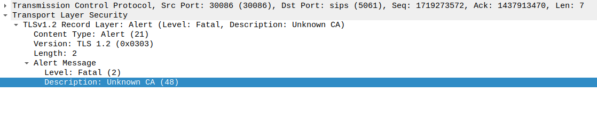
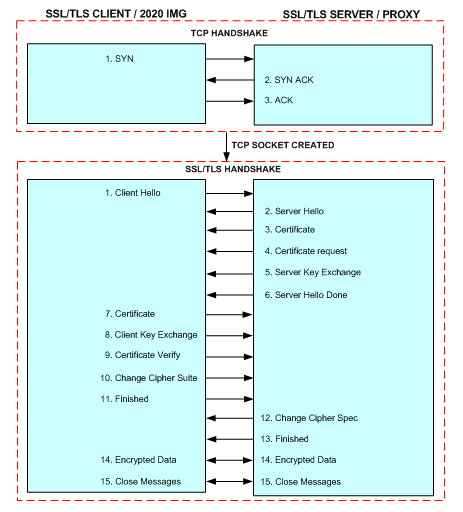
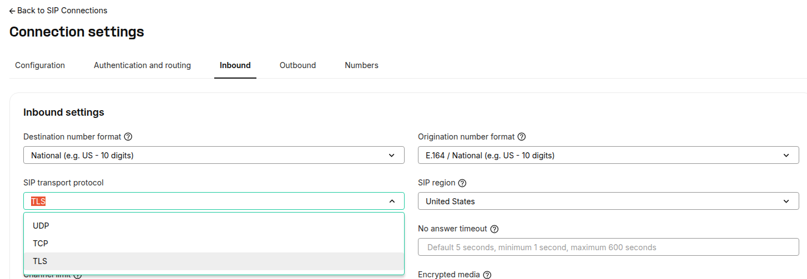
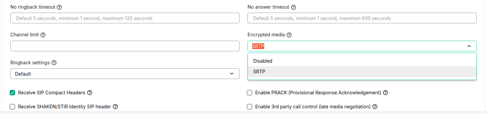

# TLS and SRTP

## Securing SIP and VoIP Calls with TLS and SRTP

When you make a call, it's the SIP protocol that contacts the receiving device, agrees on the nature of the call, and makes the connection. After that, another protocol carries the content RTP (Real-Time Protocol) of the call. When the call is over and the parties disconnect, SIP is again the protocol that terminates the call.

This may not sound like much of a security issue, but in fact, it is. That's because SIP wasn't originally designed to be secure, which means it's easily hacked. SIP is a text-based protocol. The same applies to RTP, another text based protocol for handling your calls audio/video/media. Unless an encrypted connection is requested, all of this takes place as plain text, that may travel across the open internet or your office network.

---

## SIP Security Risks: Why Encryption is Critical

At Telnyx, we provide users with the ability to establish **TLS** (Transport Layer Security) and **SRTP** (Secure Real-Time Transport Protocol) with our system for end-to-end SIP and Media encryption. By default, the features are not enabled, but are configurable from your [SIP Connection](https://portal.telnyx.com/#/app/connections). Additionally, at Telnyx, we leverage our private network to pull your traffic off the public internet and carry the media across our own fiber. By handling the media, we are able to ensure that your packets are exposed to as few public hops as possible.

In this article, we'll talk a little about how certificates work, how TLS sessions are established, and provide a brief overview of SRTP with example SDP paylods.

## Certificates for Authentication and Encryption

Certificates are used for authentication and encryption. They're always used with TLS. There's an SSL (TLS) certificate for sip.telnyx.com:5061 so that SIP-over-TLS traffic between our customers and Telnyx can be secure.

TLS/SSL certificates used for SIP are exactly the same as those used for HTTPS. There's no difference because TLS makes a separate transport layer and the protocol inside the TLS is independent of TLS. When a browser attempts to connect to a secure website using TLS, the web server sends a certificate (and proof that the server is properly using that certificate). The use of certificates is based on **chains** of trust.

The browser has a list of certificates that it trusts, but it does not have a list of *all* certificates. If the browser is to trust the certificate from the server, then the certificate is **signed** by a CA. Every certificate has an **issuer** (the certificate that signed it), and the chain of trust ends (or starts, depending on perspective) with a **Root CA** certificate. If the certificate from the web server is signed by a CA Certificate that the browser trusts, then the browser will also trust the server certificate. (Root CA certificates are signed by themselves, so are only ever explicitly trusted.)

## Certificates Chains

Whenever a client connects to TCP:sip.telnyx.com:5061, the server sends a **certificate chain**: a bundle of the server certificate and the two intermediate certificates. If the client trusts the Root CA certificate that issued the topmost intermediate certificate, then (by the chain of trust) it'll implicitly trust the sip.telnyx.com server certificate.

Modern operating systems (Android, Ubuntu, MacOS, etc) have **certificate bundles** built in. The user usually does not have to configure certificates. When new Root Certificate Authority (CA) certificates are made or certificates are revoked, OS updates look after keeping the CA bundle updated.

Some customers use **appliances** for SIP traffic. An example is an SBC (Session Border Controller), such as Audiocodes M1000, Dialogic Bordernet SBC. These appliances route SIP traffic but they don't run an Operating System (OS) and don't have a comprehensive CA bundle built in.

If these devices are to trust the certificate from sip.telnyx.com, then they must either trust the certificate directly or trust (either of) the intermediate certificates. To do this, the administrator must load a certificate into the appliance; this is usually a manual task.

Without loading a certificate to establish the trust, TLS connections cannot be made to sip.telnyx.com:5061 and therefore SIP over TLS cannot work. You can often determine this by checking the network traffic, where the client will return "Unknown CA" in the alert response when Telnyx shares the Certificate and Server Key Exchange.

[](/_images/9c236f79412de9173ebb4655fc694f71252aa34e7f3ceff04eb76846ddede302.png)

## OpenSSL

You can also check the certificates, fingerprints, and expiry dates for sip.telnyx.com:5061 using the below example openssl commands on the command line / terminal / prompt.   
​  
​**Note**: We also allow customers to use both publicly and privately signed certificates.

**Certificates**

```
openssl s_client -servername sip.telnyx.com -connect sip.telnyx.com:5061  
  
openssl s_client -showcerts -connect sip.telnyx.com:7443
```

​**Fingerprints**

```
echo | openssl s_client -connect sip.telnyx.com:5061 |& openssl x509 -fingerprint -noout
```

​**Expiry Date**

```
echo | openssl s_client -servername sip.telnyx.com -connect sip.telnyx.com:5061 2>/dev/null | openssl x509 -noout -dates
```

---

## TLS and SRTP: Securing SIP Signaling and Media

SSL and the newer version TLS are cryptographic protocols that provide security on the Internet. TLS with SIP is used to encrypt sip signaling whereas SRTP (Secure Real-time Transport Protocol) is used to encrypt media streams. It is not mandatory to use SRTP when using TLS but in order to use SRTP effectively, one must use TLS.

**TLS/SSL Handshake Protocol**

[](/_images/c05af7bc4a625ff600c193827fc37ff33c328d65958596ae25a7b1e8a1c995ae.png)

The TLS handshake protocol is used between sip client and server to establish trust and then negotiate what secret key will be used to encrypt and decrypt the traffic.

TLS runs atop the TCP protocol, so the first thing that is performed is TCP three-way handshake. Once the TCP connection is established, SSL/TLS handshake can take place.

**Step 1:** Client initiates "Client Hello" which has information such as TLS version, cryptographic algorithm and data compression method supported by the client.

**Step 2-6:** Server sends "Server Hello", agreeing on the cryptographic algorithm from the list provided by the client, amongst other parameters . It then presents its digital certificate and public key.

**Step 7-13:** Client validates the certificate presented by the server. Once the client trusts the server, key exchange (shared secret key) will take place.

**Step 14-15:** Encrypted data will flow between the two endpoints and can continue until either party chooses to close the connection.

#### Important Note:

When using Diffie-Hellman key exchange, Telnyx only supports keys sizes of 2048 bits or larger. Please make sure the key size offered by your client can meet this minimum in order to ensure encrypted data can flow between our servers and your client

## Deprecating Support for TLS 1.0 and TLS 1.1

The greater technical community has identified TLS 1.0 and TLS 1.1 to no longer meet modern standards for encryption and privacy. We aim to provide these protections to all of our customers.

In light of this, Telnyx will no longer support TLS 1.0 and TLS 1.1 after June 1st, 2021.

Before June 1st, 2021 you may need to take action to ensure that your applications continue to work without interruption. For more information on this change and how it may affect your applications, head to our [Developer Center](https://developers.telnyx.com/docs/development/sip-trunking/tls-deprecation).

---

## SRTP for Media Encryption

Once the TLS session is established, the SIP session will now take place where the negotiation of media will also be handled. Note that, with SRTP, the encryption parameters for the RTP are contained within the SIP signaling (which is why TLS should be used for SIP in the first place).

Actually, the parameters for the encryption are in the SDP (the Session Description Protocol), which is a part of the SIP message.

Remember, credential-based SIP Connections must **register** over TLS if you want inbound calls to be established over TLS. For FQDN and IP authentication based SIP Connections, you can specify the transport of choice in the SIP Connection settings.

## What is SRTP?

The Secure Real-Time Transport Protocol. SRTP is a security profile for RTP that adds confidentiality, message authentication, and replay protection to that protocol. It was initially published by the Internet Engineering Task Force (IETF) in [RFC 3711](https://tools.ietf.org/html/rfc3711) in March 2004.

SRTP uses [Advanced Encryption Standard](https://en.wikipedia.org/wiki/Advanced_Encryption_Standard) (AES) as the default [cipher](https://en.wikipedia.org/wiki/Cipher) along with two different cipher modes. Segmented Integer Counter Mode is standard, and is critical for running traffic over an unreliable network with a possible loss of packets. f8-mode is used for 3G mobile networks, and is a variation of output feedback mode designed to be seek-able with an altered initialization function.

While AES-128 is widely regarded as more than adequately secure, some users may be motivated to adopt AES-192 or AES-256 due to a perceived need to pursue a highly conservative security strategy. In the below example, you'll see Counter Mode (CM) and Galois Counter Mode (GCM).

Besides the AES cipher, SRTP allows the ability to disable encryption outright, using the so-called *NULL cipher*, which can be assumed as an alternate supported cipher. In fact, the NULL cipher does not perform any encryption if chosen. You'll also notice some suites containing the **Hash-based Message Authentication Code with Secure Hashing Algorithm 1** (HMAC-SHA1) used for integrity checks between sender and receiver on the authentication tag. If the message authentication fails and the results don't match, the packet is discarded.

## Example SDP of the media audio parameters in the SIP INVITE from the client

- In the SDP of the invite the client will send the cipher suite that can be used to encrypt the media.
- It will also mention the `m= audio parameter` the port used for the media transfer.
- In the 200 OK sent by the server, it will choose one of the cipher suites that will be used to encrypt the media.

```
Session Description Protocol  
Connection Information (c): IN IP4 198.51.100.64  
Media Description, name and address (m): audio 51895 RTP/AVP 0 101  
  
a=crypto:1 AEAD_AES_256_GCM_8 inline:URvowj9NlyRUU4Ro4NIUbg/39b1bEdLtxPelsfHpPGD9GtwWuKMMefhd76U=  
a=crypto:2 AEAD_AES_128_GCM_8 inline:uATLXs8T8rjZ0QVH15np2ExFaVZixIRvHHXOow==  
a=crypto:3 AES_256_CM_HMAC_SHA1_80 inline:JlgkqmY+uVPBLmJairIWLMTzsoP7sq6M+FLsTeZkAJUKobgTjouB0H+ZHV911Q==  
a=crypto:4 AES_192_CM_HMAC_SHA1_80 inline:aNNDkHj6o2xl2J6PkjReCqK4dvGFeV3AjZ9Lohiriq5RRu8gMq0=  
a=crypto:5 AES_CM_128_HMAC_SHA1_80 inline:TCkr9L8rtn4+aJXoeA1eiQcTAniJOvkYXUnZ5KTw  
a=crypto:6 AES_256_CM_HMAC_SHA1_32 inline:98t1wsF9qRKbb+vJO0zldPSX1RvXDI/SSrzNEUl0CHDGv84vqtz3+tJNA2JQdA==  
a=crypto:7 AES_192_CM_HMAC_SHA1_32 inline:K5rGraoWN0x2r3OHxKDMxDY4uk4TZC6z2Lu9NIU8YY/BesMyICA=  
a=crypto:8 AES_CM_128_HMAC_SHA1_32 inline:CYuxgxVh3SpfdN4uXoR5M709+19SQMuNepdP0Dw8  
a=crypto:9 AES_CM_128_NULL_AUTH inline:DzAaqmSiBsFG997HKmMhoFkxOo3c9TY7mO6fFHOn
```

## In 183 with SDP / 200 OK Telnyx agrees on one of the clients attributes and presents our media IP address

```
Session Description Protocol  
Connection Information (c): IN IP4 64.16.249.226  
Media Description, name and address (m): audio 29078 RTP/SAVP 0 101  
  
v=0  
o=root 301488255 301488255 IN IP4 64.16.249.226  
s=Asterisk PBX 13.34.0  
c=IN IP4 64.16.249.226  
t=0 0  
m=audio 29078 RTP/SAVP 0 101  
a=crypto:5 AES_CM_128_HMAC_SHA1_80 inline:7aNj4ZNv8I94feZgZP2sPmVcyNxTGIHjhkbR1rLz  
a=rtpmap:0 PCMU/8000  
a=rtpmap:101 telephone-event/8000  
a=fmtp:101 0-16  
a=ptime:20  
a=maxptime:150  
a=sendrecv
```

In this case the cipher suite 5 is chosen.

---

## TLS and SRTP Conclusion

For security reasons, you may encrypt your SIP signalling over TLS to protect the content of the SIP messages. For encrypting media, you need to use SRTP.

Credential-based SIP Connections must ensure the client specifies TLS when attempting to [REGISTER](https://support.telnyx.com/en/articles/4363904-sip-registration) with our system, in order for inbound calls to be established over TLS.

Conversely, to use TLS for outbound calls, the customer should configure his client's (server or phone, etc) transport type and choose TLS for the SIP signaling.

For IP and FQDN SIP Connections, please make sure you review your inbound settings and specify the transport as TLS. This will ensure Telnyx sets up any inbound calls over TLS.

[](/_images/21b8cee8c59fb35c15fdf282a78f5d79f0a06cb9156a4b605f4adabf569be849.png)

The media settings for SRTP are also configured in the Connection, under both the Inbound and Outbound tabs.

## Inbound and Outbound Call Security Settings

### Inbound Settings

[](/_images/3ac0bde765de1e0064805d4dbfa15964839b80fee7144827805dcd2c310dd00e.png)

When Telnyx receives a call destined to a number associated with your SIP Connection, and this SIP Connection has SRTP enabled, we will send the cipher suites in our SIP INVITEs SDP. Please make sure your system is configured to respond with a preferred cipher suite in it's 183/200 OK.

### Inbound Settings Notes

- If you respond with **no cipher suite** in your 183/200 OK, our system will **reject** the call establishment. Likewise, if you do not have SRTP enabled on the SIP Connection but respond with cipher suites in your 183/200 OK, our system will reject the call.
- Further information on Number Settings can be found [here](https://support.telnyx.com/en/articles/4349113-my-numbers-page).

### Outbound Settings

You can configure device to use SRTP and make calls without further configuration from the Telnyx Mission Control Portal. In other words, you can send a SIP INVITE with cipher suites in the SDP without having to explicitly enable SRTP on the SIP Connection - Telnyx will continue honour the offer and ensure the media is encrypted.

## Special Case: WebRTC Clients (Voice SDK)

If you are using a **WebRTC client** to make calls, you do not need to enable encrypted media settings on the SIP Connection. WebRTC clients inherently connect over encrypted WebSockets to `rtc.telnyx.com`, ensuring secure signaling and media transmission without additional configuration. If you enable these settings, you may encounter an error during call establishment. Clearer warnings will be presented on the SIP Connection settings in the near future.

---

Related Articles

- [Panasonic KX-HDV: Telnyx setup](https://support.telnyx.com/en/articles/5814406-panasonic-kx-hdv-telnyx-setup)
- [Gigaset A510: Telnyx Setup](https://support.telnyx.com/en/articles/5815209-gigaset-a510-telnyx-setup)
- [Audiocodes 400HD](https://support.telnyx.com/en/articles/5819923-audiocodes-400hd)
- [Fanvil X2CP/X2C/X2P: Call Center IP](https://support.telnyx.com/en/articles/6206756-fanvil-x2cp-x2c-x2p-call-center-ip)
- [Fanvil X-Series: IP Phone](https://support.telnyx.com/en/articles/6209971-fanvil-x-series-ip-phone)
