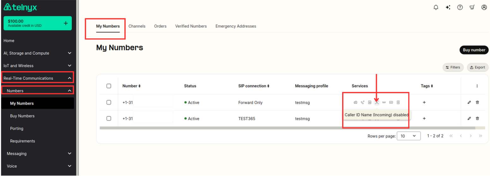
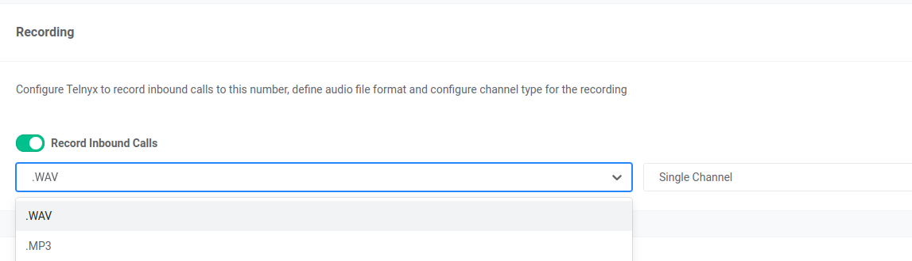
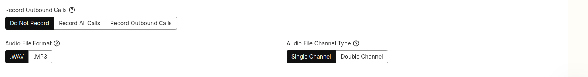
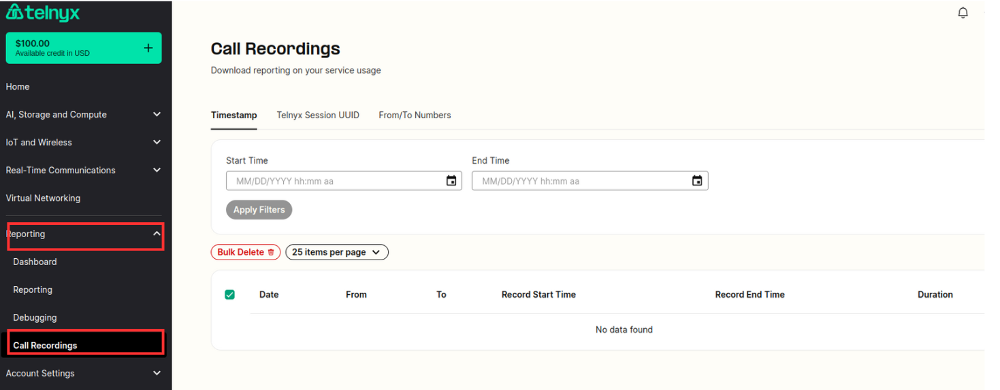

# Call Recording

## Call Recording

Telnyx offers native cloud recording for inbound and outbound calling. This can be set up via the Telnyx Mission Control portal or programmatically with the Telnyx API.   
​  
You can configure Telnyx to record inbound or outbound calls or both using the number and outbound profile settings.   
​  
Call recording is fully accessible via our API v1 where you can configure settings and find, manage, download, and delete recordings.

---

## Features of Telnyx Call Recording

- MP3 or .WAV file format
- High-quality audio
- Cloud Storage
- Immediately available
- Long term retention
- Time-stamped and searchable
- Single or Dual Channel

---

## How to set up Call Recording on the Telnyx Mission Control Portal

### Inbound

1. Go to your numbers section.
2. Select the Inbound Call Recording Icon.
3. Turn on Call Recording.
4. Select which audio file format you want .wav or .mp3.
5. Select which audio file channel type you want single or dual channel.

To set up call recording for inbound calls on a number via the Telnyx API see our developer guide [here](https://developers.telnyx.com/api-reference/numbers/list-phone-numbers).

**NOTE:** This call recording feature, on inbound calls, is recommended only for DID's associated with SIP Trunking Connections.

If your DID is associated with Voice or TeXML applications, please do not enable this feature on the DID as the recordings will not be generated. Instead, use the relevant recording features available at the [Voice API](https://developers.telnyx.com/api-reference/call-commands/dial) or [TeXML](https://developers.telnyx.com/voice/texml/texml-translator) level.

### Outbound

1. Go to your outbound voice profiles section.
2. Select the outbound voice profile you wish to set the call recording on.
3. Scroll down and click on advanced settings.
4. Select if you want to enable call recording for all outbound calls or only those outbound calls with a specific ANI (or from number).
5. Select which audio file format you want .wav or .mp3.
6. Select which audio file channel type you want single or dual channel.

To set up outbound call recording via the Telnyx API see our developer guide [here](https://developers.telnyx.com/api-reference/outbound-voice-profiles/list-outbound-voice-profiles)

## How to download or delete your call recordings

1. Go to your [reporting section](https://portal.telnyx.com/#/call-recordings) and select recordings.
2. Here you will see your most recent recordings.
3. You can search by timestamp, Telnyx session UUID, and from/to numbers.
4. Select download or delete. (You also have a bulk delete option)

## How long are the recordings made available for?

Call Recordings are stored for 1 year if you do not delete them. The 1-year max time may be subject to change. So it's recommended that you acquire any and all recordings you need in a timely manner.

To download or delete a recording via the Telnyx API see our developer guide [here](https://developers.telnyx.com/api-reference/call-recordings/list-call-recordings).

For pricing information on the Telnyx Call Recording Feature, you can check [here](https://portal.telnyx.com/#/app/pricing).

---

Related Articles

- [Call Forwarding](https://support.telnyx.com/en/articles/1130657-call-forwarding)
- [Does Telnyx support conference calls?](https://support.telnyx.com/en/articles/1130677-does-telnyx-support-conference-calls)
- [Configuring Call Control/TeXML Applications - Voice API](https://support.telnyx.com/en/articles/4374050-configuring-call-control-texml-applications-voice-api)
- [Real-Time Transcription](https://support.telnyx.com/en/articles/8292490-real-time-transcription)
- [Twilio TwiML Conference on Telnyx](https://support.telnyx.com/en/articles/13389311-twilio-twiml-conference-on-telnyx)
